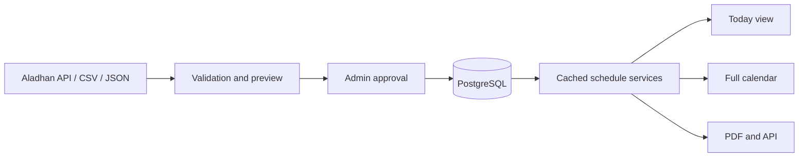

# 🌙 Ramadan Clock

> District-aware Sehri and Iftar schedules for Bangladesh, with a public daily view and protected tools for maintaining Ramadan timetable data.

[](https://www.supportkori.com/montasim)
[](https://github.com/montasim/ramadan-clock/actions/workflows/ci.yml)
[](https://app.netlify.com/projects/fasttimes/deploys)
[](LICENSE)

Ramadan Clock helps people in Bangladesh find the relevant Sehri and Iftar times for their district without searching through static posters or social posts. Visitors can check today's schedule, move between all 64 districts, browse the full Ramadan calendar, and download a district-specific PDF. A protected administration workflow supports fetching, reviewing, importing, and maintaining the underlying timetable data.

**[Open the live app](https://fasttimes.netlify.app) · [Browse the calendar](https://fasttimes.netlify.app/calendar) · [Report an issue](https://github.com/montasim/ramadan-clock/issues)**

[](https://fasttimes.netlify.app)

## Why Ramadan Clock?

Ramadan timetables are often distributed as images or manually prepared files. Those formats are difficult to search, filter, keep current, or use comfortably on a small screen. Maintainers also need a dependable way to validate and update many district schedules without introducing duplicates.

Ramadan Clock turns that information into a focused daily utility:

- See the relevant Sehri and Iftar times at a glance.
- Automatically show tomorrow's schedule after today's Iftar.
- Switch between the 64 districts of Bangladesh.
- Browse and download a complete district timetable.
- Maintain schedule data through a protected review-and-import workflow.

## Features

### For visitors

- Today's Sehri and Iftar times with live status updates
- Countdown during the final hour before a target time
- Full Ramadan calendar with current and upcoming-day indicators
- District selection across all 64 Bangladesh districts
- PDF export for a single day or the full district schedule
- Responsive layout, dark mode, loading states, and error handling
- Daily Hadith display with its source when data is available

### For administrators

- Authentication-protected dashboard and data-management routes
- Aladhan imports by date range, Gregorian month, or Hijri month
- Multi-district fetching with progress and configurable rate limiting
- CSV and JSON validation with a preview before import
- Transactional, duplicate-safe schedule writes
- Configurable Ramadan date range
- Upload history, schedule management, and cache controls

## Using the application

### Check today's times

1. Open the [home page](https://fasttimes.netlify.app).
2. Select a district; Rangpur is used when no district is provided.
3. Check the Sehri and Iftar cards for the displayed date.
4. Use the download button when you need an offline PDF.

After Iftar, the home page presents the following day's schedule while keeping the passed schedule available for reference.

### Browse the full calendar

Open the [calendar](https://fasttimes.netlify.app/calendar), choose a district, and review the available Ramadan schedule. The calendar identifies relevant dates and can export the selected district timetable as a PDF.

### Maintain timetable data

Administrators sign in at `/auth/login` and then:

1. Configure the active Ramadan date range.
2. Fetch calculated times from Aladhan or upload a CSV/JSON schedule.
3. Review validation results and preview the entries.
4. Confirm the import and manage the saved schedule.

> [!WARNING]
> Never deploy with example credentials. Use a strong administrator password and a unique authentication secret.

## Prayer-time source and accuracy

Ramadan Clock currently fetches calculated prayer times from the [Aladhan API](https://aladhan.com/prayer-times-api) with this configuration:

| Setting | Current value |
| --- | --- |
| Country | Bangladesh |
| Timezone | `Asia/Dhaka` |
| Calculation method | Method `2` — Islamic Society of North America (ISNA) |
| Sehri value | Fajr returned by Aladhan |
| Iftar value | Maghrib returned by Aladhan |
| Automatic adjustment | None (`0` minutes) |

> [!IMPORTANT]
> Calculated times can differ from local mosque or religious-authority timetables because methods and local conventions vary. Follow your trusted local authority when schedules differ.

When reporting a discrepancy, include the district, Gregorian date, displayed time, expected time, comparison timetable, and calculation source when known.

## How it works



Prayer times are stored as `YYYY-MM-DD` dates and 24-hour `HH:mm` values. PostgreSQL enforces a unique `(date, location)` pair, while the service layer handles queries, updates, imports, formatting, and status calculation. Public schedule reads use tagged caching and revalidation; external Aladhan requests include retry and token-bucket rate-limit handling.

## Technology

| Area | Technology |
| --- | --- |
| Application | Next.js 16, React 19, TypeScript 5 |
| Interface | Tailwind CSS 4, shadcn/ui, Radix UI |
| Data | PostgreSQL, Prisma ORM |
| Authentication | NextAuth, bcryptjs |
| Validation | Zod |
| Prayer-time source | Aladhan API |
| PDF generation | jsPDF, jspdf-autotable |
| Time handling | Moment.js, Moment Timezone |
| Deployment | Netlify |

## Local development

### Prerequisites

- Node.js 24 LTS
- pnpm 11.7.0
- PostgreSQL

### 1. Clone and install

```bash
git clone https://github.com/montasim/ramadan-clock.git
cd ramadan-clock
pnpm install
```

### 2. Configure the environment

Copy the safe template:

```bash
cp .env.example .env.local
```

At minimum, replace the database, authentication, and administrator placeholders:

| Variable | Purpose |
| --- | --- |
| `DATABASE_URL` | PostgreSQL connection URL |
| `NEXTAUTH_SECRET` | Authentication signing secret; use at least 32 characters |
| `NEXTAUTH_URL` | Canonical application URL |
| `ADMIN_EMAIL` | Seeded administrator email |
| `ADMIN_PASSWORD` | Seeded administrator password |
| `TIMEZONE` | Schedule timezone; defaults to `Asia/Dhaka` |
| `RAMADAN_START_DATE`, `RAMADAN_END_DATE` | Optional active schedule boundaries in `YYYY-MM-DD` format |
| `ALLOWED_ORIGINS` | Allowed web origin for production requests |
| `PROJECT_REPO_URL` | Repository link shown by the application |
| `DEVELOPER_*` | Maintainer name, biography, and contact links |
| `HADITH_API_KEY` | Optional Hadith integration key |

Generate a strong authentication secret with:

```bash
openssl rand -base64 32
```

Do not commit `.env.local` or use the example values in production.

### 3. Prepare the database

```bash
pnpm db:generate
pnpm db:push
```

Optionally seed the development administrator and sample data:

```bash
pnpm db:seed
```

`db:push` synchronizes the schema directly. Review schema changes and use an appropriate migration and backup process before applying changes to production data.

### 4. Start the application

```bash
pnpm dev
```

Open [http://localhost:3000](http://localhost:3000).

## Schedule import format

Imports accept JSON or CSV. Dates use `YYYY-MM-DD`; times use 24-hour `HH:mm`.

### JSON

```json
[
  {
    "date": "2026-02-18",
    "sehri": "05:12",
    "iftar": "17:56",
    "location": "Dhaka"
  }
]
```

### CSV

```csv
date,sehri,iftar,location
2026-02-18,05:12,17:56,Dhaka
```

The importer validates file type, file size, field formats, row limits, and duplicate `(date, location)` combinations before writing to the database.

## Routes and API documentation

| Route | Purpose | Access |
| --- | --- | --- |
| `/` | Relevant daily Sehri and Iftar schedule | Public |
| `/calendar` | Full available Ramadan schedule | Public |
| `/contact` | Project and maintainer information | Public |
| `/auth/login` | Administrator sign-in | Public |
| `/admin/dashboard` | Schedule overview and management | Protected |
| `/admin/fetch` | Fetch and preview Aladhan data | Protected |
| `/admin/import` | Import schedule data | Protected |
| `/api/schedule` | Query schedule records | API |
| `/api/health` | Application and database health | API |

See the [API usage guide](docs/api/usage-guide.md) and [OpenAPI specification](docs/api/openapi.yaml) for request and response details.

## Development commands

| Command | Purpose |
| --- | --- |
| `pnpm dev` | Start the development server |
| `pnpm build` | Generate Prisma Client and create a production build |
| `pnpm start` | Start the production server |
| `pnpm lint` | Run ESLint |
| `pnpm type-check` | Check TypeScript without emitting files |
| `pnpm test` | Run the Vitest suite |
| `pnpm test:watch` | Run tests in watch mode |
| `pnpm db:generate` | Generate Prisma Client |
| `pnpm db:push` | Synchronize the Prisma schema |
| `pnpm db:seed` | Seed development data |
| `pnpm clean:all` | Clear generated application caches |

The GitHub Actions [CI workflow](.github/workflows/ci.yml) installs dependencies, generates Prisma Client, lints, type-checks, tests, and creates a production build for pull requests and pushes to `main`.

## Deployment

The public preview is deployed on Netlify:

- Application: [fasttimes.netlify.app](https://fasttimes.netlify.app)
- Deployment history: [Netlify deploys](https://app.netlify.com/projects/fasttimes/deploys)

For another deployment, configure the variables from `.env.example` in the hosting environment. Use the production URL for `NEXTAUTH_URL` and `ALLOWED_ORIGINS`, provide production database and administrator credentials, and run the normal `pnpm build` command.

## Project status and limitations

Ramadan Clock is a pre-release public project. Keep these constraints in mind:

- Displayed schedules depend on the records currently stored in the database.
- Aladhan imports depend on a third-party service and use calculated prayer times.
- The calculation method and local convention may differ from an authority's timetable.
- Administrator access controls schedule-changing operations and must be protected with production-grade credentials.
- Automated tests currently cover core time-entry behavior; broader API, timezone, import, and PDF coverage remains planned.

## Documentation

- [API usage guide](docs/api/usage-guide.md)
- [OpenAPI specification](docs/api/openapi.yaml)
- [Aladhan integration](docs/aladhan-api-implementation-summary.md)
- [Caching guide](docs/caching-implementation-guide.md)
- [Cache troubleshooting](docs/cache-troubleshooting-guide.md)
- [Rate-limiting guide](docs/rate-limiting-guide.md)
- [Contribution guide](CONTRIBUTING.md)
- [Security policy](SECURITY.md)
- [Code of conduct](CODE_OF_CONDUCT.md)

## Support and security

Read the [support guide](SUPPORT.md) to choose the right channel. Use [GitHub Issues](https://github.com/montasim/ramadan-clock/issues) for reproducible bugs and feature requests. Include the affected route, district, date, expected result, and actual result where relevant. Never post credentials, database URLs, private information, or other secrets in an issue.

Report vulnerabilities privately according to the [security policy](SECURITY.md), not through a public issue.

## Contributing

Issues and pull requests are welcome. Read [CONTRIBUTING.md](CONTRIBUTING.md) for the local workflow, required checks, and schedule-discrepancy guidance. Participation is governed by the [Code of Conduct](CODE_OF_CONDUCT.md).

## Funding

Ramadan Clock is developed as a community-focused project. Optional financial support helps cover hosting, database costs, schedule verification, and continued improvements.

[](https://www.supportkori.com/montasim)

Bug reports, code contributions, documentation improvements, feedback, and sharing the project are equally valuable ways to help.

## Author

Built and maintained by [Montasim](https://github.com/montasim).

## License

Ramadan Clock is open-source software licensed under the [MIT License](LICENSE).
