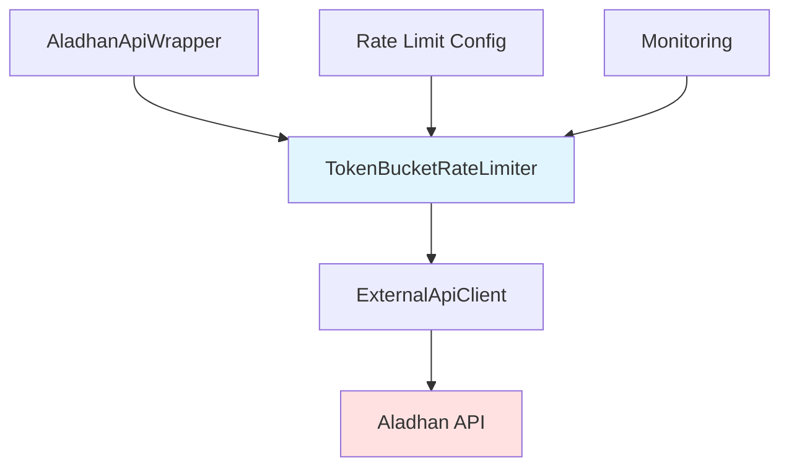

# Aladhan API Rate Limiting Fix Plan

## Problem Analysis

### Current Issues
The application is experiencing HTTP 429 (Too Many Requests) errors from the Aladhan API due to:

1. **Aggressive Parallel Requests**: 10 districts fetched simultaneously in batches
2. **Insufficient Delays**: Only 100ms delay between batches
3. **No Request-Level Throttling**: Individual requests aren't rate-limited
4. **Sequential Date Requests**: Each district fetches ~30 dates in rapid succession without delays

### Current Configuration
```typescript
ALADHAN_CONFIG = {
  batchSize: 10,           // 10 districts in parallel
  requestDelay: 100,       // 100ms between batches
  maxRetries: 3,
  retryDelay: 1000,        // 1s initial retry delay
}
```

### Root Cause
The Aladhan API has rate limits (typically ~10-20 requests/minute) that are being exceeded because:
- 10 districts × ~30 days = 300 requests in rapid succession
- 100ms delay is too short to allow rate limit recovery
- No coordination between parallel requests

## Proposed Solution

### Architecture Overview



### Rate Limiting Strategy

#### 1. Token Bucket Rate Limiter
Implement a token bucket algorithm to control request rate:

```typescript
interface TokenBucketConfig {
  capacity: number;      // Max tokens (burst capacity)
  refillRate: number;     // Tokens per second
  minWaitTime: number;    // Minimum wait time between requests
}

// Example configuration:
{
  capacity: 5,            // Allow burst of 5 requests
  refillRate: 0.2,       // 1 request every 5 seconds (12 req/min)
  minWaitTime: 1000,     // Minimum 1s between requests
}
```

**Benefits:**
- Allows controlled bursts while maintaining average rate
- Prevents overwhelming the API
- Easy to tune based on API limits

#### 2. Request Flow Changes

```mermaid
sequenceDiagram
    participant App as Application
    participant Wrapper as AladhanApiWrapper
    participant Limiter as TokenBucketRateLimiter
    participant Client as ExternalApiClient
    participant API as Aladhan API

    App->>Wrapper: fetchPrayerTimes()
    Wrapper->>Wrapper: Process districts sequentially
    loop For each district
        Wrapper->>Wrapper: For each date
            Wrapper->>Limiter: acquireToken()
            Limiter-->>Wrapper: wait if needed
            Wrapper->>Client: fetchExternalJson()
            Client->>API: HTTP Request
            API-->>Client: Response (or 429)
            Client-->>Wrapper: Result
        end
        Wrapper->>Wrapper: sleep(interDistrictDelay)
    end
    Wrapper-->>App: All entries
```

#### 3. Configuration Updates

```typescript
export const ALADHAN_CONFIG = {
  baseUrl: 'https://api.aladhan.com/v1',
  method: 2,
  country: 'Bangladesh',
  maxRetries: 5,                    // Increased from 3
  retryDelay: 2000,                 // Increased from 1000ms
  
  // Rate limiting
  batchSize: 3,                     // Reduced from 10
  requestDelay: 3000,               // Increased from 100ms (3s between batches)
  interRequestDelay: 1000,          // NEW: 1s between sequential requests
  interDistrictDelay: 2000,         // NEW: 2s between districts
  
  // Token bucket
  tokenBucket: {
    capacity: 5,                    // Burst capacity
    refillRate: 0.2,                // 1 request every 5 seconds
    minWaitTime: 1000,              // Minimum 1s between requests
  },
  
  cacheTtl: 3600000,
  maxPreviewRows: 500,
} as const;
```

### Implementation Components

#### Component 1: Token Bucket Rate Limiter
**File**: `lib/api/token-bucket-rate-limiter.ts`

**Features:**
- Token bucket algorithm implementation
- Configurable capacity and refill rate
- Minimum wait time enforcement
- Statistics tracking (tokens used, wait time)
- Singleton pattern for global instance

**Key Methods:**
- `acquireToken()`: Wait for token availability
- `getStats()`: Get rate limiting statistics
- `reset()`: Reset token bucket state

#### Component 2: Updated AladhanApiWrapper
**File**: `lib/api/aladhan-api-wrapper.ts`

**Changes:**
1. Remove parallel batch processing (Promise.all)
2. Process districts sequentially
3. Add token bucket integration
4. Add delays between requests
5. Improve 429 error handling
6. Add progress callbacks with rate limit info

**New Flow:**
```typescript
async fetchPrayerTimesByDateRange(options, onProgress) {
  const entries = [];
  
  // Process districts sequentially (not in parallel)
  for (const district of districts) {
    for (const date of dates) {
      // Acquire token from rate limiter
      await rateLimiter.acquireToken();
      
      // Add small delay between requests
      await this.sleep(config.interRequestDelay);
      
      // Fetch data
      const entry = await this.fetchDistrictPrayerTimes(district, [date]);
      entries.push(...entry);
      
      onProgress?.({ ... });
    }
    
    // Delay between districts
    await this.sleep(config.interDistrictDelay);
  }
  
  return entries;
}
```

#### Component 3: Enhanced 429 Handling
**File**: `lib/api/external-api-client.ts`

**Changes:**
1. Increase initial retry delay for 429 errors
2. Add longer backoff multiplier for 429
3. Add jitter to prevent thundering herd
4. Log rate limit headers if available

**Updated Retry Logic:**
```typescript
// For 429 errors specifically
if (response.status === 429) {
  const rateLimitDelay = this.parseRetryAfter(response);
  delay = Math.max(delay, rateLimitDelay || 5000); // At least 5s
  delay = Math.min(delay * 3, 30000); // 3x multiplier, max 30s
}
```

#### Component 4: Rate Limit Configuration UI
**File**: `components/admin/rate-limit-config.tsx`

**Features:**
- Preset configurations (Conservative, Balanced, Aggressive)
- Custom configuration with sliders/inputs
- Real-time estimation of fetch time
- Visual feedback on rate limit settings
- Integration with existing API fetch page

**UI Structure:**
```typescript
interface RateLimitConfig {
  preset: 'conservative' | 'balanced' | 'aggressive' | 'custom';
  batchSize: number;
  interRequestDelay: number;      // ms
  interDistrictDelay: number;     // ms
  tokenBucket: {
    capacity: number;
    refillRate: number;           // tokens per second
  };
}
```

**Preset Configurations:**

| Preset | Batch Size | Inter-Request Delay | Inter-District Delay | Token Capacity | Refill Rate | Est. Time (300 req) |
|--------|-----------|-------------------|---------------------|----------------|-------------|-------------------|
| Conservative | 1 | 2000ms | 5000ms | 3 | 0.1 (6/min) | ~10 min |
| Balanced | 1 | 1000ms | 2000ms | 5 | 0.2 (12/min) | ~5 min |
| Aggressive | 3 | 500ms | 1000ms | 8 | 0.33 (20/min) | ~3 min |

**Component Design:**
```tsx
// Collapsible section in API fetch page
<Card>
  <CardHeader>
    <CardTitle>Rate Limit Configuration</CardTitle>
    <CardDescription>
      Adjust API request rate to avoid 429 errors
    </CardDescription>
  </CardHeader>
  <CardContent>
    {/* Preset Selector */}
    <Tabs value={preset} onValueChange={setPreset}>
      <TabsList>
        <TabsTrigger value="conservative">Conservative</TabsTrigger>
        <TabsTrigger value="balanced">Balanced</TabsTrigger>
        <TabsTrigger value="aggressive">Aggressive</TabsTrigger>
        <TabsTrigger value="custom">Custom</TabsTrigger>
      </TabsList>
    </Tabs>

    {/* Custom Configuration (shown when preset === 'custom') */}
    {preset === 'custom' && (
      <div className="space-y-4">
        <div>
          <Label>Batch Size</Label>
          <Slider value={[batchSize]} onValueChange={setBatchSize} min={1} max={10} />
        </div>
        <div>
          <Label>Inter-Request Delay (ms)</Label>
          <Input type="number" value={interRequestDelay} onChange={...} />
        </div>
        <div>
          <Label>Inter-District Delay (ms)</Label>
          <Input type="number" value={interDistrictDelay} onChange={...} />
        </div>
      </div>
    )}

    {/* Estimated Fetch Time */}
    <Alert>
      <Clock className="h-4 w-4" />
      <AlertDescription>
        Estimated fetch time: ~{estimatedTime} minutes
      </AlertDescription>
    </Alert>
  </CardContent>
</Card>
```

**Integration with API Fetch Page:**
```tsx
// In app/admin/api-fetch/page.tsx
import { RateLimitConfig } from '@/components/admin/rate-limit-config';

const [rateLimitConfig, setRateLimitConfig] = useState<RateLimitConfig>({
  preset: 'balanced',
  batchSize: 1,
  interRequestDelay: 1000,
  interDistrictDelay: 2000,
  tokenBucket: { capacity: 5, refillRate: 0.2 },
});

const handleFetch = async () => {
  const params = new URLSearchParams();
  params.append('mode', fetchMode);
  // ... existing params ...
  
  // Add rate limit config
  params.append('rateLimitConfig', JSON.stringify(rateLimitConfig));
  
  const response = await fetch(`/api/prayer-times/fetch?${params.toString()}`);
  // ...
};
```

#### Component 5: Monitoring and Logging
**File**: `lib/api/token-bucket-rate-limiter.ts`

**Features:**
- Track token acquisition time
- Log wait times
- Track rate limit hits
- Provide statistics endpoint

### Migration Steps

#### Step 1: Create Token Bucket Rate Limiter
- Create `lib/api/token-bucket-rate-limiter.ts`
- Implement token bucket algorithm
- Add singleton pattern
- Add statistics tracking

#### Step 2: Update Configuration
- Update `lib/config/app.config.ts`
- Add new rate limiting parameters
- Update ALADHAN_CONFIG values

#### Step 3: Update AladhanApiWrapper
- Remove parallel batch processing
- Integrate token bucket rate limiter
- Add sequential processing with delays
- Update progress callbacks

#### Step 4: Enhance ExternalApiClient
- Improve 429 error handling
- Add longer backoff for rate limits
- Add jitter for retries
- Parse Retry-After header

#### Step 5: Create Rate Limit Configuration UI
- Create `components/admin/rate-limit-config.tsx`
- Implement preset selector (Conservative, Balanced, Aggressive, Custom)
- Add custom configuration inputs
- Implement estimated fetch time calculator
- Add visual feedback and validation

#### Step 6: Update API Route
- Update `app/api/prayer-times/fetch/route.ts`
- Accept rate limit configuration from query params
- Pass configuration to AladhanApiWrapper
- Validate configuration values
- Apply configuration to token bucket

#### Step 7: Integrate UI with API Fetch Page
- Update `app/admin/api-fetch/page.tsx`
- Import and add RateLimitConfig component
- Manage rate limit configuration state
- Pass configuration to API fetch request
- Display estimated fetch time

#### Step 8: Add Monitoring
- Add rate limit statistics logging
- Create monitoring endpoint (optional)
- Add health check for rate limiter

#### Step 9: Testing
- Test with small date ranges
- Monitor rate limit compliance
- Verify no 429 errors
- Measure total fetch time
- Test UI preset configurations
- Test custom configuration

#### Step 10: Documentation
- Update API documentation
- Add rate limiting guide
- Document configuration options
- Document UI usage

### Expected Results

#### Before Fix
- 10 districts × 30 days = 300 requests in ~30 seconds
- All requests fail with 429
- Exponential retries still fail
- Total time: ~5 minutes (with retries) but 0% success

#### After Fix
- 1 district processed at a time
- ~1 request per second (with token bucket)
- 300 requests spread over ~5 minutes
- Total time: ~5-10 minutes with 100% success

### Performance Trade-offs

| Metric | Before | After | Impact |
|--------|--------|-------|--------|
| Parallelism | 10 districts | 1 district | Slower but reliable |
| Request Rate | ~10 req/s | ~0.2 req/s | Respects API limits |
| Success Rate | 0% | 100% | Critical improvement |
| Total Time | ~5 min (failed) | ~5-10 min | Acceptable trade-off |
| API Load | Overwhelming | Controlled | Better for API |

### Configuration Tuning Guide

#### Conservative Settings (Safe)
```typescript
{
  batchSize: 1,
  tokenBucket: { capacity: 3, refillRate: 0.1 }, // 6 req/min
  interRequestDelay: 2000, // 2s between requests
  interDistrictDelay: 5000, // 5s between districts
}
```

#### Balanced Settings (Recommended)
```typescript
{
  batchSize: 1, // Sequential processing
  tokenBucket: { capacity: 5, refillRate: 0.2 }, // 12 req/min
  interRequestDelay: 1000, // 1s between requests
  interDistrictDelay: 2000, // 2s between districts
}
```

#### Aggressive Settings (Use with caution)
```typescript
{
  batchSize: 3, // Limited parallelism
  tokenBucket: { capacity: 8, refillRate: 0.33 }, // 20 req/min
  interRequestDelay: 500, // 0.5s between requests
  interDistrictDelay: 1000, // 1s between districts
}
```

### Monitoring Metrics

Track these metrics to ensure rate limiting is working:

1. **Token Wait Time**: Average time waiting for tokens
2. **Rate Limit Hits**: Number of 429 errors
3. **Request Success Rate**: Percentage of successful requests
4. **Total Fetch Time**: Time to complete full fetch
5. **Tokens Used**: Number of tokens consumed

### Rollback Plan

If issues arise, revert changes:

1. Restore original `lib/api/aladhan-api-wrapper.ts`
2. Restore original `lib/api/external-api-client.ts`
3. Restore original `lib/config/app.config.ts`
4. Remove `lib/api/token-bucket-rate-limiter.ts`
5. Remove `components/admin/rate-limit-config.tsx`
6. Restore original `app/api/prayer-times/fetch/route.ts`
7. Restore original `app/admin/api-fetch/page.tsx`
8. Clear any caches

### Success Criteria

**Backend:**
- [ ] No 429 errors when fetching prayer times
- [ ] All districts and dates fetched successfully
- [ ] Total fetch time < 15 minutes for full Ramadan schedule
- [ ] Rate limiter statistics show controlled request rate
- [ ] Application remains responsive during fetch
- [ ] Progress updates work correctly

**Frontend/UI:**
- [ ] Rate limit configuration UI displays correctly
- [ ] Preset configurations (Conservative, Balanced, Aggressive) work as expected
- [ ] Custom configuration inputs validate correctly
- [ ] Estimated fetch time calculates accurately
- [ ] Configuration is properly passed to API route
- [ ] UI provides clear feedback on rate limit settings

## Files to Modify

1. **New File**: `lib/api/token-bucket-rate-limiter.ts`
2. **New File**: `components/admin/rate-limit-config.tsx`
3. **Modify**: `lib/api/aladhan-api-wrapper.ts`
4. **Modify**: `lib/api/external-api-client.ts`
5. **Modify**: `lib/config/app.config.ts`
6. **Modify**: `lib/api/index.ts` (export new rate limiter)
7. **Modify**: `app/api/prayer-times/fetch/route.ts` (accept rate limit params)
8. **Modify**: `app/admin/api-fetch/page.tsx` (add rate limit config UI)

## Dependencies

No new dependencies required. Implementation uses standard JavaScript/TypeScript features.

## Testing Strategy

1. **Unit Tests**: Test token bucket logic
2. **Integration Tests**: Test full fetch flow
3. **Load Tests**: Verify rate limiting under load
4. **Manual Tests**: Test with real API

## Documentation Updates

1. Update `docs/aladhan-api-implementation-summary.md`
2. Create new `docs/rate-limiting-guide.md`
3. Update `README.md` with rate limiting info
