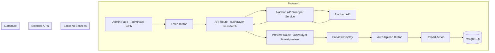
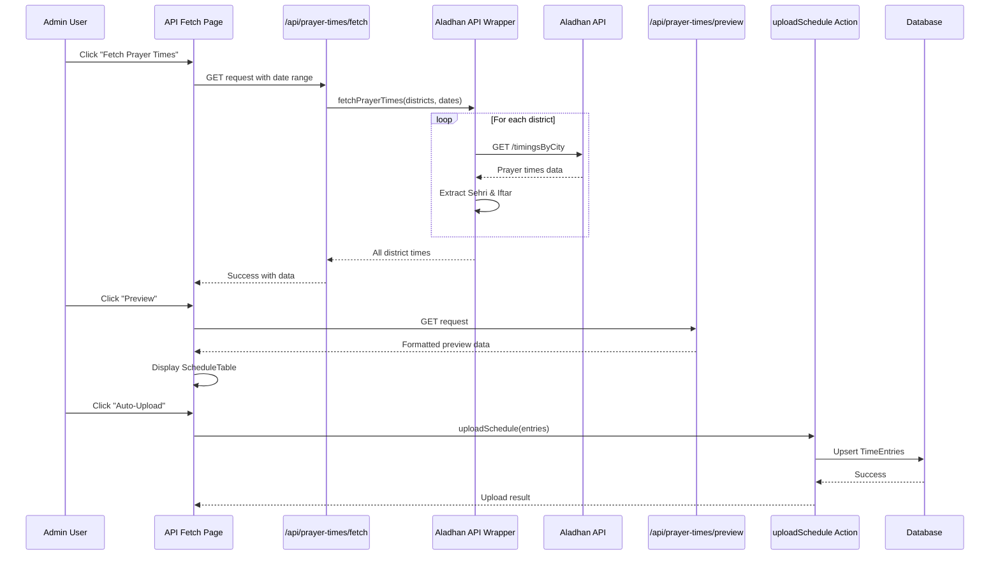

# Aladhan API Wrapper Implementation Plan

## Overview
Create an API wrapper that fetches all Bangladesh district sehri and iftar times from the Aladhan API, displays them as a preview similar to manual upload, and provides options to auto-upload the fetched data to the database.

## System Architecture



## Data Flow



## Implementation Details

### 1. Aladhan API Wrapper Service

**File:** `lib/api/aladhan-api-wrapper.ts`

**Responsibilities:**
- Fetch prayer times from Aladhan API for Bangladesh districts
- Extract Sehri (Fajr) and Iftar (Maghrib) times
- Format data to match TimeEntry schema
- Handle rate limiting and retries using existing ExternalApiClient
- Support fetching for date ranges (Ramadan period)
- Support fetching for multiple months at once

**Key Functions:**
```typescript
interface AladhanPrayerTimes {
  date: string;
  sehri: string;  // Fajr time
  iftar: string;  // Maghrib time
  location: string; // District name
}

interface DateRangeOptions {
  mode: 'dateRange';
  startDate: string; // YYYY-MM-DD
  endDate: string;   // YYYY-MM-DD
  districts?: string[]; // Optional: specific districts
}

interface MultiMonthOptions {
  mode: 'multiMonth';
  year: number;
  months: number[]; // Array of month numbers (1-12)
  districts?: string[]; // Optional: specific districts
}

type FetchOptions = DateRangeOptions | MultiMonthOptions;

class AladhanApiWrapper {
  async fetchPrayerTimes(options: FetchOptions): Promise<AladhanPrayerTimes[]>
  async fetchPrayerTimesByDateRange(options: DateRangeOptions): Promise<AladhanPrayerTimes[]>
  async fetchPrayerTimesByMultiMonth(options: MultiMonthOptions): Promise<AladhanPrayerTimes[]>
  async fetchDistrictPrayerTimes(district: string, date: string): Promise<AladhanPrayerTimes>
  private extractSehriIftar(data: AladhanResponse): { sehri: string; iftar: string }
  private generateDateRange(startDate: string, endDate: string): string[]
  private generateDatesForMonths(year: number, months: number[]): string[]
}
```

**Aladhan API Endpoints:**
- `https://api.aladhan.com/v1/timingsByCity?city={city}&country=Bangladesh&method=2&date={date}`
- Method 2: Islamic Society of North America (ISNA) - commonly used in Bangladesh

**Multi-Month Fetch Logic:**
```typescript
// Example: Fetch for March, April, May 2026
const dates = generateDatesForMonths(2026, [3, 4, 5]);
// Returns: ['2026-03-01', '2026-03-02', ..., '2026-05-31']
// Total: 92 days (31 + 30 + 31 = 92)
// March: 31 days, April: 30 days, May: 31 days

// Then fetch prayer times for each date and district
```

### 3. API Route: Fetch Prayer Times

**File:** `app/api/prayer-times/fetch/route.ts`

**Responsibilities:**
- Handle GET requests to fetch prayer times
- Validate date range or multi-month parameters
- Call Aladhan API wrapper
- Return formatted data or error

**Request (Date Range Mode):**
```typescript
GET /api/prayer-times/fetch?mode=dateRange&startDate=2026-03-01&endDate=2026-03-30&districts=Dhaka,Chittagong
```

**Request (Multi-Month Mode):**
```typescript
GET /api/prayer-times/fetch?mode=multiMonth&year=2026&months=3,4,5&districts=Dhaka,Chittagong
```

**Response:**
```typescript
{
  success: true,
  data: {
    entries: AladhanPrayerTimes[],
    meta: {
      totalDistricts: 64,
      totalDays: 92, // Total days across all selected months
      totalEntries: 5888, // 64 districts * 92 days
      fetchMode: 'multiMonth' | 'dateRange',
      dateRange: {
        start: '2026-03-01',
        end: '2026-05-31'
      }
    }
  }
}
```

### 4. API Route: Preview Fetched Data

**File:** `app/api/prayer-times/preview/route.ts`

**Responsibilities:**
- Return preview data for fetched prayer times
- Support pagination and filtering by district
- Reuse existing validation logic

**Request:**
```typescript
GET /api/prayer-times/preview?district=Dhaka&page=1&limit=50
```

### 5. Multi-Month Selector Component

**File:** `components/admin/multi-month-selector.tsx`

**Responsibilities:**
- Display year selector dropdown
- Display month checkboxes (January - December)
- Calculate and display total days and estimated entries
- Support select all / deselect all months
- Show Ramadan months highlighted

**Props:**
```typescript
interface MultiMonthSelectorProps {
  year: number;
  selectedMonths: number[];
  onYearChange: (year: number) => void;
  onMonthToggle: (month: number) => void;
  onSelectAll: () => void;
  onDeselectAll: () => void;
  ramadanMonths?: number[]; // Optional: highlight Ramadan months
}
```

**UI Layout:**
```
┌─────────────────────────────────────────────────┐
│ Year: [2026 ▼]                                  │
├─────────────────────────────────────────────────┤
│ Months:                                         │
│ ┌─────────────────────────────────────────────┐ │
│ │ [☑] January  [☑] February  [☑] March      │ │
│ │ [☑] April    [☑] May       [☑] June       │ │
│ │ [☑] July     [☑] August    [☑] September  │ │
│ │ [☑] October  [☑] November  [☑] December   │ │
│ └─────────────────────────────────────────────┘ │
├─────────────────────────────────────────────────┤
│ [Select All] [Deselect All]                     │
├─────────────────────────────────────────────────┤
│ Total: 3 months, 92 days, ~5,888 entries       │
└─────────────────────────────────────────────────┘
```

**Helper Functions:**
```typescript
// Calculate total days for selected months
function calculateTotalDays(year: number, months: number[]): number

// Calculate estimated entries (days × districts)
function calculateEstimatedEntries(totalDays: number, districtCount: number): number

// Check if month is in Ramadan
function isRamadanMonth(month: number): boolean
```

### 6. Admin Page: API Fetch with Preview

**File:** `app/admin/api-fetch/page.tsx`

**Responsibilities:**
- Provide UI for fetching prayer times from Aladhan API
- Display date range picker OR multi-month selector
- Show district selection (all or specific)
- Display fetched data in preview using ScheduleTable component
- Support district-wise calendar view
- Provide auto-upload button

**UI Components to Reuse:**
- `ScheduleTable` - For displaying preview data
- `CalendarView` - For district-wise calendar view
- `AppModal` - For confirmation dialogs
- `ScheduleCard` - For wrapping preview section
- `Badge` - For status indicators
- `Tabs` - For switching between fetch modes
- Existing styles and gradients

**Page Structure:**
```
┌─────────────────────────────────────────────┐
│ Hero Section: API Fetch                     │
├─────────────────────────────────────────────┤
│ Fetch Mode Tabs:                            │
│ [Date Range] [Multi-Month]                  │
├─────────────────────────────────────────────┤
│ Date Range Picker OR Multi-Month Selector   │
│ (Start Date - End Date) OR Select Months    │
│ ┌─────────────────────────────────────────┐ │
│ │ Year: 2026 ▼                          │ │
│ │ Months: [☑ March] [☑ April] [☑ May] │ │
│ └─────────────────────────────────────────┘ │
├─────────────────────────────────────────────┤
│ District Selection                          │
│ [ ] All Districts                           │
│ [ ] Select Specific Districts               │
├─────────────────────────────────────────────┤
│ [Fetch Prayer Times] Button                 │
├─────────────────────────────────────────────┤
│ Preview Section (after fetch)                │
│ ┌─────────────────────────────────────────┐ │
│ │ District Tabs: [All] [Dhaka] [Chittagong] │ │
│ ├─────────────────────────────────────────┤ │
│ │ ScheduleTable with fetched data          │ │
│ └─────────────────────────────────────────┘ │
├─────────────────────────────────────────────┤
│ Actions:                                    │
│ [Export JSON] [Export CSV] [Auto-Upload]   │
└─────────────────────────────────────────────┘
```

**Multi-Month Selection Component:**
```typescript
interface MultiMonthSelectorProps {
  year: number;
  selectedMonths: number[];
  onMonthToggle: (month: number) => void;
  onYearChange: (year: number) => void;
}

// Months displayed as checkboxes: January, February, March, etc.
// Supports selecting multiple months at once
// Calculates total days and estimated entries
```

### 7. Export Functionality

**File:** `lib/utils/export.utils.ts` (or add to existing utils)

**Responsibilities:**
- Export fetched prayer times to JSON format
- Export fetched prayer times to CSV format
- Support filtering by district before export
- Generate downloadable files with proper naming

**Key Functions:**
```typescript
interface ExportOptions {
  data: AladhanPrayerTimes[];
  format: 'json' | 'csv';
  filename?: string;
  filterDistrict?: string;
}

function exportPrayerTimes(options: ExportOptions): void

// Helper functions
function convertToCSV(data: AladhanPrayerTimes[]): string
function convertToJSON(data: AladhanPrayerTimes[]): string
function generateFilename(format: string, dateRange: string): string
```

**Export Button Component:**
```typescript
interface ExportButtonProps {
  data: AladhanPrayerTimes[];
  disabled?: boolean;
}

// UI: Dropdown with two options
// - Export as JSON
// - Export as CSV
```

**Integration in Admin Page:**
- Add export buttons in the preview section
- Export all fetched data or filtered by selected district
- Use existing download patterns from manual upload page

### 8. Auto-Upload Functionality

**Implementation:**
- Reuse existing `uploadSchedule` action from `actions/upload.actions.new.ts`
- Convert Aladhan prayer times to ParsedEntry format
- Show progress indicator during upload
- Display success/error results

**Data Transformation:**
```typescript
AladhanPrayerTimes -> ParsedEntry
{
  date: string,        // YYYY-MM-DD
  sehri: string,       // HH:mm (converted from API format)
  iftar: string,       // HH:mm (converted from API format)
  location: string      // District name
}
```

## File Structure

```
lib/api/
├── aladhan-api-wrapper.ts      # NEW: Aladhan API wrapper service

lib/utils/
├── export.utils.ts             # NEW: Export utilities (JSON/CSV)

app/api/prayer-times/
├── fetch/
│   └── route.ts                 # NEW: Fetch prayer times from Aladhan
├── preview/
│   └── route.ts                 # NEW: Preview fetched data

app/admin/
├── api-fetch/
│   └── page.tsx                # NEW: Admin page for API fetch

components/admin/
├── multi-month-selector.tsx     # NEW: Multi-month selection component
├── export-button.tsx            # NEW: Export button component

actions/
├── prayer-times.actions.ts      # NEW: Server actions for prayer times
```

## Configuration Updates

**File:** `lib/config/app.config.ts`

Add new configuration:
```typescript
export const ALADHAN_CONFIG = {
  baseUrl: 'https://api.aladhan.com/v1',
  method: 2, // ISNA method
  country: 'Bangladesh',
  maxRetries: 3,
  retryDelay: 1000,
  batchSize: 10, // Number of districts to fetch in parallel
  requestDelay: 100, // Delay between batches (ms)
  cacheTtl: 3600000, // Cache TTL in ms (1 hour)
  maxPreviewRows: 500, // Maximum rows per preview page
} as const;
```

**File:** `.env.example`

Add environment variables:
```
# Aladhan API Configuration
ALADHAN_API_KEY=optional_api_key_if_needed
```

## Key Features

1. **Batch Fetching**: Fetch all 64 districts efficiently with rate limiting
2. **Date Range Support**: Fetch for any date range (Ramadan period)
3. **Multi-Month Support**: Fetch multiple months at once with month selection
4. **District Filtering**: Fetch all districts or select specific ones
5. **Preview Mode**: View fetched data before uploading
6. **Calendar View**: District-wise calendar view using existing CalendarView
7. **Auto-Upload**: One-click upload to database using existing upload logic
8. **Export Functionality**: Export fetched data to JSON or CSV format
9. **Progress Tracking**: Real-time progress for fetch and upload operations
10. **Error Handling**: Proper error messages and retry logic
11. **Caching**: Cache API responses to avoid unnecessary requests

## Reused Components

From existing codebase:
- `ScheduleTable` - Display preview data
- `CalendarView` - District-wise calendar view
- `AppModal` - Confirmation dialogs
- `ScheduleCard` - Card wrapper
- `Badge` - Status indicators
- `Button` - Action buttons
- `Card` - Card layout
- `Alert` - Status messages
- `Tabs` - Switch between fetch modes
- `Checkbox` - Multi-month selection
- `Select` - Year and district selection
- `UploadService` - Upload logic
- `ExternalApiClient` - API client with retry
- `DownloadButton` - Download button from existing components

New components to create:
- `MultiMonthSelector` - Multi-month selection UI
- `ExportButton` - Export button with JSON/CSV options logic

## Validation

Data validation will use existing schemas:
- `timeEntryCreateSchema` - Validate individual entries
- `batchTimeEntrySchema` - Validate batch uploads

## Error Handling

### Network Errors
- Retry with exponential backoff using existing `ExternalApiClient`
- Timeout handling for long-running requests
- Connection failure recovery

### API Errors
- Display user-friendly messages for API failures
- Handle rate limiting (429 status) with automatic retry
- Handle server errors (500+) with proper retry logic
- Log all errors for debugging

### Validation Errors
- Show specific validation failures with row numbers
- Highlight invalid entries in preview
- Prevent upload of invalid data

### Edge Cases
- Invalid date ranges (end date before start date)
- Future dates beyond reasonable limits
- Empty district selection
- Leap year handling for February dates
- Time zone conversion issues

### Rate Limiting
- Respect Aladhan API rate limits (typically 100 requests/minute)
- Implement request queuing for large batch operations
- Add delay between district requests to avoid throttling
- Display progress during rate-limited operations

## Performance Optimization

### Batch Processing
- Process districts in parallel batches (e.g., 10 districts at a time)
- Use `Promise.allSettled` for concurrent requests
- Implement progressive loading for UI responsiveness

### Caching Strategy
- Cache API responses at the date level (same date for different districts)
- Implement in-memory cache for current session
- Cache expiration after 1 hour
- Clear cache on manual refresh

### Memory Management
- Stream large datasets to avoid memory issues
- Implement pagination for preview (max 500 entries per page)
- Use efficient data structures (Map/Set for lookups)

### UI Performance
- Debounce user inputs (date pickers, district selection)
- Use React.memo for expensive components
- Implement virtual scrolling for large lists
- Show skeleton loaders during data fetching

### Database Optimization
- Use bulk upsert operations (existing in `UploadService`)
- Implement transaction batching for large uploads
- Index optimization on `date` and `location` columns

## Implementation Status

### Completed Components
- ✅ Aladhan API Wrapper Service
- ✅ Multi-Month Selector Component
- ✅ Export Button Component and Export Utilities
- ✅ API Route: Fetch Prayer Times
- ✅ API Route: Preview Fetched Data
- ✅ Admin Page: API Fetch with Preview
- ✅ Auto-Upload Functionality (reuses existing upload logic)
- ✅ Performance Optimizations
- ✅ Error Handling and Edge Cases

### Testing Required
- ⏳ Test fetching for single district
- ⏳ Test fetching for all districts
- ⏳ Test date range mode
- ⏳ Test multi-month mode
- ⏳ Test export functionality (JSON and CSV)
- ⏳ Test auto-upload to database
- ⏳ Test error scenarios
- ⏳ Test performance with large datasets

## Testing Considerations

1. Test fetching for single district
2. Test fetching for all districts
3. Test date range boundaries
4. Test data transformation (API format to DB format)
5. Test preview display
6. Test auto-upload functionality
7. Test error scenarios (network failure, invalid dates)
8. Test concurrent requests

## Future Enhancements

1. Schedule automatic fetch via cron job
2. Support for other prayer time APIs
3. Compare with existing data and show differences
4. Manual time adjustment before upload
5. Bulk edit fetched times before upload
6. Save fetch configurations as presets
7. Add time zone conversion options
