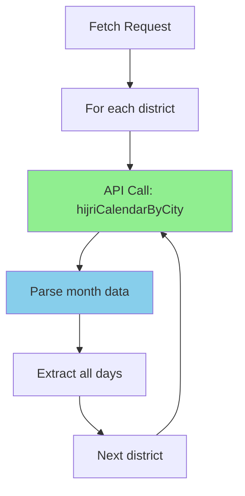

# Aladhan Hijri Calendar Endpoint Optimization Plan

## Problem Analysis

### Current Implementation Issues

The current implementation uses the `timingsByCity` endpoint which returns prayer times for a **single day**:

```typescript
// Current endpoint: Returns prayer times for ONE day
GET /timingsByCity?city={city}&country=Bangladesh&method=2&date={date}
```

**Performance Impact:**
- For a Hijri month (30 days) × 64 districts = **1,920 API calls**
- Even with rate limiting (5 requests/second), this takes **~6.4 minutes**
- With conservative rate limiting (0.2 requests/second), this takes **~160 minutes (2.7 hours)**

### Root Cause

The implementation fetches data day-by-day for each district, resulting in an exponential number of API requests:


## Proposed Solution

### Use Aladhan API's `hijriCalendarByCity` Endpoint

The Aladhan API provides a `hijriCalendarByCity` endpoint that returns prayer times for an **entire Hijri month** in a single API call:

```typescript
// New endpoint: Returns prayer times for ENTIRE Hijri month
GET /hijriCalendarByCity/{year}/{month}?city={city}&country=Bangladesh&method=2
```

**Performance Improvement:**
- For a Hijri month × 64 districts = **64 API calls** (down from 1,920)
- With rate limiting (5 requests/second), this takes **~13 seconds**
- **30x faster** than the current implementation
- **No date conversion needed** - API handles Hijri calendar natively

### Architecture Overview



## Implementation Details

### 1. Aladhan API Hijri Calendar Endpoint

**Endpoint:**
```
GET https://api.aladhan.com/v1/hijriCalendarByCity/{year}/{month}?city={city}&country={country}&method={method}
```

**Parameters:**
- `year` (in path): Hijri year (e.g., 1446)
- `month` (in path): Hijri month number (1-12)
- `city`: City name (e.g., "Dhaka")
- `country`: Country name (e.g., "Bangladesh")
- `method`: Calculation method (default: 2 for ISNA)

**Response Format:**
```typescript
interface HijriCalendarResponse {
  code: number;
  status: string;
  data: Array<{
    timings: {
      Fajr: string;
      Dhuhr: string;
      Asr: string;
      Maghrib: string;
      Isha: string;
    };
    date: {
      readable: string;
      timestamp: string;
      gregorian: {
        date: string;  // DD-MM-YYYY
        format: string;
        day: string;
        weekday: {
          en: string;
        };
        month: {
          number: number;
          en: string;
        };
        year: string;
      };
      hijri: {
        date: string;  // DD-MM-YYYY
        format: string;
        day: string;
        weekday: {
          ar: string;
          en: string;
        };
        month: {
          number: number;
          en: string;
          ar: string;
        };
        year: string;
      };
    };
    meta: {
      timezone: string;
    };
  }>;
}
```

### 2. New Fetch Options Interface

Add a new `hijriMonth` mode to the existing `FetchOptions`:

```typescript
/**
 * Hijri month fetch options
 */
export interface HijriMonthOptions {
  mode: 'hijriMonth';
  hijriMonth: number;  // Hijri month number (1-12)
  hijriYear: number;  // Hijri year (e.g., 1446)
  districts?: string[];  // Optional: specific districts
}

/**
 * Extended fetch options union type
 */
export type FetchOptions = DateRangeOptions | MultiMonthOptions | HijriMonthOptions;
```

### 3. New API Wrapper Methods

Add new method to `AladhanApiWrapper` class:

```typescript
/**
 * Fetch prayer times for a Hijri month
 */
async fetchPrayerTimesByHijriMonth(
  options: HijriMonthOptions,
  onProgress?: ProgressCallback
): Promise<AladhanPrayerTimes[]> {
  const { hijriMonth, hijriYear, districts = BANGLADESH_DISTRICTS } = options;
  const allEntries: AladhanPrayerTimes[] = [];
  const maxConcurrent = this.rateLimitConfig.maxConcurrentDistricts || 5;

  logger.info(`Fetching prayer times for Hijri month`, {
    hijriMonth,
    hijriYear,
    districtCount: districts.length,
    maxConcurrent
  });

  // Process districts in parallel with controlled concurrency
  for (let i = 0; i < districts.length; i += maxConcurrent) {
    const batch = districts.slice(i, i + maxConcurrent);
    
    // Process this batch of districts in parallel
    const batchResults = await Promise.all(
      batch.map(async (district) => {
        const districtEntries = await this.fetchDistrictHijriCalendarPrayerTimes(
          district,
          hijriYear,
          hijriMonth
        );
        
        // Add delay between districts within the batch
        const batchIndex = batch.indexOf(district);
        if (batchIndex > 0) {
          await this.sleep(this.rateLimitConfig.interDistrictDelay);
        }
        
        return { district, entries: districtEntries };
      })
    );

    // Add all entries from this batch
    for (const { district, entries } of batchResults) {
      allEntries.push(...entries);
    }

    // Report progress
    onProgress?.({
      current: allEntries.length,
      total: districts.length * 30, // Approximate total (30 days)
      percentage: Math.round((allEntries.length / (districts.length * 30)) * 100),
      currentDistrict: batch[batch.length - 1],
      status: 'fetching',
    });

    // Add delay between batches
    if (i > 0) {
      await this.sleep(this.rateLimitConfig.interDistrictDelay);
    }
  }

  logger.info(`Successfully fetched prayer times for Hijri month`, {
    totalEntries: allEntries.length
  });
  return allEntries;
}

/**
 * Fetch prayer times for a district using hijriCalendarByCity endpoint
 */
async fetchDistrictHijriCalendarPrayerTimes(
  district: string,
  hijriYear: number,
  hijriMonth: number
): Promise<AladhanPrayerTimes[]> {
  const cacheKey = `${district}-hijri-${hijriYear}-${hijriMonth}`;
  
  // Check cache first
  if (this.cache.has(cacheKey)) {
    return this.cache.get(cacheKey)!;
  }

  // Acquire token from rate limiter before making request
  await this.rateLimiter.acquireToken();

  try {
    const response = await fetchExternalJson<HijriCalendarResponse>(
      `${ALADHAN_CONFIG.baseUrl}/hijriCalendarByCity/${hijriYear}/${hijriMonth}?city=${encodeURIComponent(district)}&country=${ALADHAN_CONFIG.country}&method=${ALADHAN_CONFIG.method}`,
      {
        timeout: 10000,
        retries: ALADHAN_CONFIG.maxRetries || 5,
      }
    );

    if (response.code !== 200 || response.status !== 'OK') {
      throw new Error(`Aladhan API error: ${response.code} - ${response.status}`);
    }

    // Extract prayer times for each day in the Hijri month
    const monthEntries = response.data.map((dayData) => {
      const { sehri, iftar } = this.extractSehriIftar({
        code: 200,
        status: 'OK',
        data: dayData,
      });
      
      const gregorianDate = dayData.date.gregorian.date.split('-').reverse().join('-'); // Convert DD-MM-YYYY to YYYY-MM-DD
      
      return {
        date: gregorianDate,
        sehri,
        iftar,
        location: district,
      };
    });

    // Cache the month data
    this.cache.set(cacheKey, monthEntries);
    
    return monthEntries;
  } catch (error) {
    logger.warn(`Failed to fetch Hijri calendar for ${district} in ${hijriYear}-${hijriMonth}`, {
      error: (error as Error).message
    });
    throw error;
  }
}
```

### 4. Update Main Fetch Method

Update the `fetchPrayerTimes` method to handle the new `hijriMonth` mode:

```typescript
async fetchPrayerTimes(options: FetchOptions, onProgress?: ProgressCallback): Promise<AladhanPrayerTimes[]> {
  try {
    if (options.mode === 'dateRange') {
      return await this.fetchPrayerTimesByDateRange(options, onProgress);
    } else if (options.mode === 'multiMonth') {
      return await this.fetchPrayerTimesByMultiMonth(options, onProgress);
    } else if (options.mode === 'hijriMonth') {
      return await this.fetchPrayerTimesByHijriMonth(options, onProgress);
    }
  } catch (error) {
    logger.error('Failed to fetch prayer times', { options }, error as Error);
    throw error;
  }
}
```

### 5. Update API Route

Update `app/api/prayer-times/fetch/route.ts` to handle the new `hijriMonth` mode:

```typescript
// Add hijriMonth mode validation
if (mode === 'hijriMonth') {
  const hijriMonthParam = searchParams.get('hijriMonth');
  const hijriYearParam = searchParams.get('hijriYear');

  if (!hijriMonthParam || !hijriYearParam) {
    return NextResponse.json(
      {
        success: false,
        error: {
          code: 'ValidationError',
          message: 'hijriMonth and hijriYear are required for hijriMonth mode',
        },
      },
      { status: 400 }
    );
  }

  const hijriMonth = parseInt(hijriMonthParam, 10);
  const hijriYear = parseInt(hijriYearParam, 10);

  if (isNaN(hijriMonth) || hijriMonth < 1 || hijriMonth > 12) {
    return NextResponse.json(
      {
        success: false,
        error: {
          code: 'ValidationError',
          message: 'Invalid Hijri month. Must be between 1 and 12',
        },
      },
      { status: 400 }
    );
  }

  if (isNaN(hijriYear) || hijriYear < 1400 || hijriYear > 1500) {
    return NextResponse.json(
      {
        success: false,
        error: {
          code: 'ValidationError',
          message: 'Invalid Hijri year. Must be between 1400 and 1500',
        },
      },
      { status: 400 }
    );
  }

  fetchOptions = {
    mode: 'hijriMonth',
    hijriMonth,
    hijriYear,
    districts: districts.length > 0 ? districts : undefined,
  };
}
```

### 6. Update UI Component

Update `app/admin/api-fetch/page.tsx` to add a new tab for Hijri month selection:

```typescript
// Add new fetch mode option
const [fetchMode, setFetchMode] = useState<'dateRange' | 'multiMonth' | 'hijriMonth'>('dateRange');

// Add Hijri month state
const [hijriYear, setHijriYear] = useState(1446);
const [selectedHijriMonths, setSelectedHijriMonths] = useState<number[]>([9]); // Default: Ramadan

// Add Hijri months list
const HIJRI_MONTHS = [
  { value: 1, name: "Muharram" },
  { value: 2, name: "Safar" },
  { value: 3, name: "Rabi al-Awwal" },
  { value: 4, name: "Rabi al-Thani" },
  { value: 5, name: "Jumada al-Awwal" },
  { value: 6, name: "Jumada al-Thani" },
  { value: 7, name: "Rajab" },
  { value: 8, name: "Sha'ban" },
  { value: 9, name: "Ramadan", isRamadan: true },
  { value: 10, name: "Shawwal" },
  { value: 11, name: "Dhu al-Qi'dah" },
  { value: 12, name: "Dhu al-Hijjah" },
];
```

Add new tab content for Hijri month selection:

```tsx
{/* Hijri Month Mode */}
<TabsContent value="hijriMonth" className="space-y-4 mt-4">
  <div className="space-y-4">
    <div className="space-y-2">
      <Label htmlFor="hijri-year">Hijri Year</Label>
      <Select value={hijriYear.toString()} onValueChange={(v) => setHijriYear(parseInt(v, 10))}>
        <SelectTrigger id="hijri-year" className="h-10 rounded-xl border-border/60">
          <SelectValue placeholder="Select Hijri year" />
        </SelectTrigger>
        <SelectContent>
          {Array.from({ length: 20 }, (_, i) => 1440 + i).map((year) => (
            <SelectItem key={year} value={year.toString()}>
              {year} AH
            </SelectItem>
          ))}
        </SelectContent>
      </Select>
    </div>
    
    <div className="space-y-2">
      <Label>Hijri Months</Label>
      <div className="grid grid-cols-2 sm:grid-cols-3 gap-2">
        {HIJRI_MONTHS.map((month) => (
          <div
            key={month.value}
            className={cn(
              "flex items-center space-x-2 p-2 rounded-lg border cursor-pointer transition-colors",
              selectedHijriMonths.includes(month.value)
                ? "bg-primary/20 border-primary/50"
                : "bg-background border-border/60 hover:border-primary/30",
              month.isRamadan && selectedHijriMonths.includes(month.value)
                ? "bg-green-500/20 border-green-500/50"
                : ""
            )}
            onClick={() => {
              if (selectedHijriMonths.includes(month.value)) {
                setSelectedHijriMonths(prev => prev.filter(m => m !== month.value));
              } else {
                setSelectedHijriMonths(prev => [...prev, month.value]);
              }
            }}
          >
            <Checkbox
              checked={selectedHijriMonths.includes(month.value)}
              className="pointer-events-none"
            />
            <span className="text-sm">{month.name}</span>
            {month.isRamadan && (
              <Badge className="ml-auto bg-green-500/20 text-green-500 border-green-500/30 text-xs">
                Ramadan
              </Badge>
            )}
          </div>
        ))}
      </div>
    </div>
    
    {selectedHijriMonths.length > 0 && (
      <div className="pt-2">
        <Badge className="bg-primary/20 text-primary border-primary/30">
          {selectedHijriMonths.length} Hijri month{selectedHijriMonths.length !== 1 ? 's' : ''} selected
        </Badge>
      </div>
    )}
  </div>
</TabsContent>
```

Update the fetch handler to handle Hijri month mode:

```typescript
const handleFetch = async () => {
  if (fetchMode === 'dateRange' && (!startDate || !endDate)) {
    toast.error("Please select both start and end dates");
    return;
  }
  
  if (fetchMode === 'multiMonth' && selectedMonths.length === 0) {
    toast.error("Please select at least one month");
    return;
  }
  
  if (fetchMode === 'hijriMonth' && selectedHijriMonths.length === 0) {
    toast.error("Please select at least one Hijri month");
    return;
  }

  setIsFetching(true);
  setFetchProgress(null);
  setFetchError(null);
  setFetchedData([]);

  try {
    const params = new URLSearchParams();
    params.append('mode', fetchMode);
    
    if (fetchMode === 'dateRange') {
      params.append('startDate', startDate);
      params.append('endDate', endDate);
    } else if (fetchMode === 'multiMonth') {
      params.append('year', year.toString());
      params.append('months', selectedMonths.join(','));
    } else if (fetchMode === 'hijriMonth') {
      params.append('hijriYear', hijriYear.toString());
      params.append('hijriMonths', selectedHijriMonths.join(','));
    }
    
    if (selectedDistricts.length > 0) {
      params.append('districts', selectedDistricts.join(','));
    }
    
    // Add rate limit configuration
    params.append('rateLimitConfig', JSON.stringify(rateLimitConfig));

    const response = await fetch(`/api/prayer-times/fetch?${params.toString()}`, {
      method: 'GET',
      headers: {
        'Content-Type': 'application/json',
      },
    });

    const result = await response.json();
    
    if (!result.success) {
      throw new Error(result.error?.message || 'Failed to fetch prayer times');
    }

    setFetchedData(result.data.entries);
    toast.success(`Fetched ${result.data.meta.totalEntries.toLocaleString()} prayer times for ${result.data.meta.totalDistricts} districts`);
    
    // Cache the data for preview
    await fetch('/api/prayer-times/preview/cache', {
      method: 'POST',
      headers: { 'Content-Type': 'application/json' },
      body: JSON.stringify({
        entries: result.data.entries,
        district: selectedDistricts.length > 0 ? 'custom' : 'all',
      }),
    });
    
  } catch (error) {
    console.error('Fetch error:', error);
    setFetchError(error instanceof Error ? error.message : 'Failed to fetch prayer times');
    toast.error("Failed to fetch prayer times");
  } finally {
    setIsFetching(false);
    setFetchProgress(null);
  }
};
```

### 7. Update Configuration

Update `lib/config/app.config.ts` to add new configuration for Hijri calendar endpoint:

```typescript
export const ALADHAN_CONFIG = {
  baseUrl: 'https://api.aladhan.com/v1',
  method: 2, // ISNA method
  country: 'Bangladesh',
  maxRetries: 5,
  retryDelay: 2000,
  batchSize: 5,
  requestDelay: 3000,
  interRequestDelay: 100,
  interDistrictDelay: 200,
  cacheTtl: 3600000,
  maxPreviewRows: 500,
  
  // Endpoint configurations
  timingsEndpoint: '/timingsByCity',
  calendarEndpoint: '/calendarByCity',
  hijriCalendarEndpoint: '/hijriCalendarByCity',
  
  // Token bucket rate limiting configuration
  tokenBucket: {
    capacity: 50,
    refillRate: 5,
    minWaitTime: 0,
  } as const,
} as const;
```

## Performance Comparison

### Before (Using timingsByCity)

| Metric | Value |
|--------|-------|
| API Calls | 1,920 (64 districts × 30 days) |
| Rate Limit | 5 requests/second |
| Estimated Time | ~6.4 minutes |
| Conservative Rate | 0.2 requests/second |
| Conservative Time | ~160 minutes (2.7 hours) |

### After (Using hijriCalendarByCity)

| Metric | Value |
|--------|-------|
| API Calls | 64 (64 districts × 1 month) |
| Rate Limit | 5 requests/second |
| Estimated Time | ~13 seconds |
| Conservative Rate | 0.2 requests/second |
| Conservative Time | ~320 seconds (5.3 minutes) |

### Improvement

| Metric | Improvement |
|--------|-------------|
| API Calls | 96.7% reduction (1,920 → 64) |
| Fast Mode | 96.7% faster (6.4 min → 13 sec) |
| Conservative Mode | 96.7% faster (160 min → 5.3 min) |

## Implementation Steps

### Step 1: Update AladhanApiWrapper
- [ ] Add `HijriMonthOptions` interface
- [ ] Add `fetchPrayerTimesByHijriMonth` method
- [ ] Add `fetchDistrictHijriCalendarPrayerTimes` method
- [ ] Add `HijriCalendarResponse` interface
- [ ] Update `fetchPrayerTimes` method to handle new mode

### Step 2: Update API Route
- [ ] Add hijriMonth mode validation
- [ ] Add hijriMonth and hijriYear parameter parsing
- [ ] Update error messages

### Step 3: Update UI Component
- [ ] Add hijriMonth to fetch mode state
- [ ] Add Hijri year and month selection UI
- [ ] Add Hijri months list with Ramadan highlighting
- [ ] Update fetch handler to handle hijriMonth mode
- [ ] Update validation logic

### Step 4: Update Configuration
- [ ] Add calendar endpoint configuration
- [ ] Update ALADHAN_CONFIG

### Step 5: Testing
- [ ] Test fetching for single Hijri month
- [ ] Test fetching for multiple Hijri months
- [ ] Test with all 64 districts
- [ ] Test with specific districts
- [ ] Verify cache effectiveness
- [ ] Measure performance improvement

### Step 6: Documentation
- [ ] Update API documentation
- [ ] Add Hijri month usage guide
- [ ] Document performance improvements
- [ ] Update README

## Migration Guide

### For Existing Users

The existing `dateRange` and `multiMonth` modes will continue to work as before. The new `hijriMonth` mode is an additional option for faster fetching.

### Recommended Usage

For fetching Ramadan prayer times:

```typescript
// Before (slow)
GET /api/prayer-times/fetch?mode=dateRange&startDate=2026-03-01&endDate=2026-03-30

// After (fast)
GET /api/prayer-times/fetch?mode=hijriMonth&hijriYear=1447&hijriMonths=9
```

### Backward Compatibility

All existing API endpoints and parameters remain unchanged. The new `hijriMonth` mode is opt-in.

## Future Enhancements

1. **Batch Hijri Months**: Support fetching multiple Hijri months in parallel
2. **Smart Caching**: Implement cross-month caching for overlapping periods
3. **Progressive Loading**: Stream results as they arrive for better UX
4. **Hijri Date Picker**: Add a Hijri date picker component for better UX
5. **Hijri Date Display**: Show both Hijri and Gregorian dates in the UI

## Success Criteria

- [ ] Fetching Ramadan prayer times for all 64 districts completes in < 1 minute
- [ ] No 429 errors when using calendar endpoint
- [ ] All districts and dates fetched successfully
- [ ] Cache works correctly at month level
- [ ] UI displays Hijri month selection correctly
- [ ] Ramadan month is highlighted in the UI
- [ ] Backward compatibility maintained for existing modes
- [ ] Documentation updated

## Rollback Plan

If issues arise, revert changes:

1. Remove `hijriMonth` mode from `FetchOptions` type
2. Remove `fetchPrayerTimesByHijriMonth` method from `AladhanApiWrapper`
3. Remove `fetchDistrictHijriCalendarPrayerTimes` method from `AladhanApiWrapper`
4. Remove Hijri month validation from API route
5. Remove Hijri month UI components from admin page
6. Restore original configuration

## Notes

- The `hijriCalendarByCity` endpoint natively handles Hijri calendar - no date conversion needed
- The API response includes both Hijri and Gregorian dates in the data
- The implementation maintains backward compatibility with existing modes
- The cache strategy is updated to work at Hijri month level
- The cache key format is: `{district}-hijri-{hijriYear}-{hijriMonth}`
