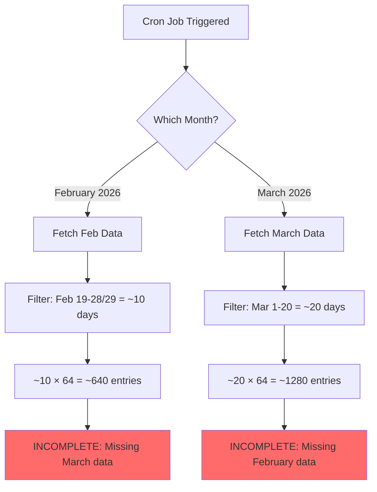

# API Fetch Issue Analysis & Solution Plan

## Problem Statement

When using auto upload, the system is not consistently fetching all **1920 entries** (30 days of Ramadan × 64 districts of Bangladesh).

## Root Cause Analysis

### Current Configuration

Based on [`.env`](.env:46-48):
```env
RAMADAN_START_DATE="2026-02-19"
RAMADAN_END_DATE="2026-03-20"
```

This spans **30 days** across **2 months**:
- February 2026: ~10 days (Feb 19-28/29)
- March 2026: ~20 days (March 1-20)

### The Problem

The cron job's [`executeForSpecificMonth()`](lib/cron/prayer-time-cron.ts:234-409) method only fetches data for **ONE month at a time**:

```typescript
async executeForSpecificMonth(year: number, month: number): Promise<CronExecutionResult> {
  // Only fetches data for the specified month
  let apiDataMap = await this.fetchLocationsWithRetry(month, year);
  // ...
}
```

### Data Flow Issue



### Why It's Inconsistent

1. **If cron runs in February**: Gets ~640 entries (10 days × 64 districts)
2. **If cron runs in March**: Gets ~1280 entries (20 days × 64 districts)
3. **Neither gets the full 1920 entries** (30 days × 64 districts)

## Proposed Solutions

### Solution 1: Multi-Month Fetch (Recommended)

Modify the cron job to detect when Ramadan spans multiple months and fetch data for all relevant months.

**Implementation Steps:**

1. **Add a new method to detect Ramadan month range**
   ```typescript
   getRamadanMonthRange(): { startMonth: number; endMonth: number; year: number }
   ```

2. **Add a new method to fetch data for multiple months**
   ```typescript
   async fetchAllRamadanMonths(): Promise<Map<string, PrayerTimeData[]>>
   ```

3. **Update cron job to use multi-month fetch**
   ```typescript
   async executeRamadanUpdate(): Promise<CronExecutionResult>
   ```

**Files to Modify:**
- [`lib/cron/prayer-time-cron.ts`](lib/cron/prayer-time-cron.ts)
- [`lib/api/prayer-time-api.ts`](lib/api/prayer-time-api.ts)

**Pros:**
- Ensures all 1920 entries are fetched
- Works regardless of when cron runs
- Handles Ramadan spanning 2 or 3 months

**Cons:**
- More API calls (2-3 months × 64 districts)
- Slightly longer execution time

### Solution 2: Always Fetch Both Months

Simpler approach: Always fetch data for both February and March when Ramadan is expected.

**Implementation Steps:**

1. Hardcode or configure the months to fetch
2. Fetch both months and merge results

**Pros:**
- Simpler implementation
- Guaranteed to get all data

**Cons:**
- Less flexible (doesn't adapt to different Ramadan dates)
- May fetch unnecessary data

### Solution 3: Manual Month Selection

Allow users to specify which months to fetch via API parameters.

**Implementation Steps:**

1. Add `months` parameter to cron API
2. Fetch specified months

**Pros:**
- Maximum flexibility
- User has full control

**Cons:**
- Requires manual intervention
- Not automated

## Detailed Implementation Plan (Solution 1)

### Phase 1: Add Helper Methods to PrayerTimeAPIService

**File:** [`lib/api/prayer-time-api.ts`](lib/api/prayer-time-api.ts)

```typescript
/**
 * Fetch prayer times for multiple months
 */
async fetchMultipleMonths(
  months: Array<{ month: number; year: number }>,
  districts: District[] = Object.keys(LOCATION_COORDINATES) as District[]
): Promise<Map<string, PrayerTimeData[]>> {
  const results = new Map<string, PrayerTimeData[]>();
  
  // Fetch all months in parallel
  const monthPromises = months.map(async ({ month, year }) => {
    return this.fetchAllLocations(month, year, districts);
  });
  
  const monthResults = await Promise.all(monthPromises);
  
  // Merge results from all months
  for (const monthResult of monthResults) {
    for (const [location, prayerTimes] of monthResult.entries()) {
      if (!results.has(location)) {
        results.set(location, []);
      }
      results.get(location)!.push(...prayerTimes);
    }
  }
  
  return results;
}
```

### Phase 2: Add Month Range Detection

**File:** [`lib/cron/prayer-time-cron.ts`](lib/cron/prayer-time-cron.ts)

```typescript
/**
 * Get the range of months that contain Ramadan days
 */
private getRamadanMonthRange(): Array<{ month: number; year: number }> {
  const startDate = new Date(RAMADAN_CONFIG.startDate || '2025-03-01');
  const endDate = new Date(RAMADAN_CONFIG.endDate || '2025-03-30');
  
  const months: Array<{ month: number; year: number }> = [];
  const current = new Date(startDate);
  
  // Add the start month
  months.push({
    month: current.getMonth() + 1,
    year: current.getFullYear(),
  });
  
  // Add subsequent months until we reach the end date
  while (current <= endDate) {
    current.setMonth(current.getMonth() + 1);
    if (current <= endDate) {
      months.push({
        month: current.getMonth() + 1,
        year: current.getFullYear(),
      });
    }
  }
  
  return months;
}
```

### Phase 3: Update Cron Job Execution

**File:** [`lib/cron/prayer-time-cron.ts`](lib/cron/prayer-time-cron.ts)

```typescript
/**
 * Execute update for all Ramadan months
 */
async executeRamadanUpdate(): Promise<CronExecutionResult> {
  const startTime = Date.now();
  const timestamp = new Date().toISOString();
  const errors: string[] = [];
  
  logger.info('[Cron] Starting full Ramadan prayer time update');
  
  try {
    // Get all months that contain Ramadan days
    const ramadanMonths = this.getRamadanMonthRange();
    logger.info(`[Cron] Ramadan spans ${ramadanMonths.length} month(s): ${ramadanMonths.map(m => `${m.year}-${m.month}`).join(', ')}`);
    
    // Step 1: Fetch prayer times for all Ramadan months
    logger.info('[Cron] Fetching prayer times from API...');
    let apiDataMap: Map<string, any[]>;
    
    try {
      apiDataMap = await this.apiService.fetchMultipleMonths(ramadanMonths);
      const locationsProcessed = apiDataMap.size;
      
      if (locationsProcessed === 0) {
        throw new Error('No locations were processed from the API');
      }
      
      logger.info(`[Cron] Fetched data for ${locationsProcessed} locations across ${ramadanMonths.length} month(s)`);
    } catch (apiError) {
      logger.error('[Cron] API fetch failed after retries', { error: apiError });
      
      // Try fallback strategy if enabled
      if (this.config.fallbackToCache) {
        logger.info('[Cron] Attempting fallback to cached data...');
        try {
          // Use the first month for fallback
          const firstMonth = ramadanMonths[0];
          apiDataMap = await this.getFallbackData(firstMonth.month, firstMonth.year);
          errors.push('API fetch failed, used cached data as fallback');
        } catch (fallbackError) {
          throw new Error(
            `API fetch failed and fallback unavailable: ${apiError instanceof Error ? apiError.message : 'Unknown error'}`
          );
        }
      } else {
        throw apiError;
      }
    }
    
    // Rest of the processing remains the same...
    // (Step 2: Process and validate, Step 3: Upload, etc.)
    
  } catch (error) {
    // Error handling...
  }
}
```

### Phase 4: Update API Route

**File:** [`app/api/cron/prayer-times/route.ts`](app/api/cron/prayer-times/route.ts)

Add a new parameter to trigger full Ramadan update:

```typescript
export async function POST(request: NextRequest) {
  try {
    // ... existing auth code ...
    
    const body = await request.json().catch(() => ({}));
    const { year, month, fullRamadan } = body;
    
    const cron = getPrayerTimeCron();
    let result;
    
    if (fullRamadan) {
      // Execute for all Ramadan months
      result = await cron.executeRamadanUpdate();
    } else if (year && month) {
      // Execute for specific month
      result = await cron.executeForSpecificMonth(year, month);
    } else {
      // Execute for current month
      result = await cron.executeMonthlyUpdate();
    }
    
    // ... rest of the code ...
  }
}
```

## Expected Results

After implementing Solution 1:

- ✅ All **1920 entries** will be fetched consistently (30 days × 64 districts)
- ✅ Works regardless of when the cron job runs
- ✅ Handles Ramadan spanning 2 or 3 months
- ✅ Maintains existing retry and fallback logic
- ✅ Preserves error handling and logging

## Testing Checklist

- [ ] Test with Ramadan spanning 2 months (Feb-Mar)
- [ ] Test with Ramadan spanning 3 months (if applicable)
- [ ] Test API failure scenarios
- [ ] Test fallback to cached data
- [ ] Verify all 1920 entries are uploaded
- [ ] Verify no duplicate entries
- [ ] Verify data integrity (correct dates, times, locations)

## Additional Considerations

1. **Rate Limiting**: Fetching multiple months may hit API rate limits. Consider:
   - Adding delays between month fetches
   - Implementing rate limiting in the API client

2. **Caching**: The current cache is per-location-per-month. This should work correctly with multi-month fetch.

3. **Performance**: Consider fetching months sequentially instead of in parallel if API rate limits are a concern.

4. **Monitoring**: Add metrics to track:
   - Number of entries fetched per month
   - Total entries fetched
   - API call success/failure rates
