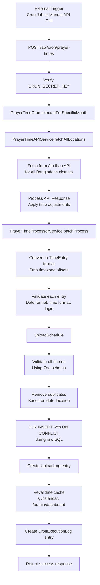

# Auto Upload Flow Analysis

## Overview

The automated prayer time upload system fetches prayer times from the Aladhan API, processes them, and stores them in the database. This document provides a step-by-step analysis of the complete flow.

## Architecture Diagram



## Step-by-Step Flow

### Step 1: Trigger the Cron Job

**Endpoint:** `POST /api/cron/prayer-times`

**File:** [`app/api/cron/prayer-times/route.ts`](app/api/cron/prayer-times/route.ts:39-122)

**Process:**
1. Verify `CRON_SECRET_KEY` from `Authorization: Bearer <token>` header
2. Parse request body for optional `year` and `month` parameters
3. If not provided, use current year and month
4. Call [`PrayerTimeCron.executeForSpecificMonth()`](lib/cron/prayer-time-cron.ts:65-195)

**Security:**
- Requires valid `CRON_SECRET_KEY` environment variable
- Prevents unauthorized execution of cron jobs

### Step 2: Fetch Prayer Times from API

**Service:** [`PrayerTimeAPIService.fetchAllLocations()`](lib/api/prayer-time-api.ts:120-150)

**Process:**
1. Get list of all Bangladesh districts from [`LOCATION_COORDINATES`](lib/config/locations.config.ts)
2. For each district, fetch prayer times from Aladhan API in parallel using `Promise.all()`
3. API endpoint: `https://api.aladhan.com/v1/calendar/{year}/{month}?latitude={lat}&longitude={lng}&method={method}&school={school}`
4. Each location fetch returns a month's worth of prayer times (typically 28-31 days)
5. Results are collected in a `Map<string, PrayerTimeData[]>` where key is district name

**Configuration:**
- Base URL: `PRAYER_TIME_API_URL` (default: `https://api.aladhan.com/v1`)
- Calculation method: `PRAYER_TIME_API_METHOD` (default: `2` = ISNA)
- School (Madhab): `PRAYER_TIME_API_SCHOOL` (default: `0` = Shafi)
- Timeout: 30 seconds
- Max retries: 3 with exponential backoff

**Caching:**
- In-memory cache with 24-hour timeout
- Cache key format: `{location}-{year}-{month}`
- Reduces API calls for repeated requests

### Step 3: Process API Response

**Method:** [`PrayerTimeAPIService.processAPIResponse()`](lib/api/prayer-time-api.ts:196-229)

**Process:**
1. Extract `Fajr` (Sehri) and `Maghrib` (Iftar) times from API response
2. Apply time adjustments configured via environment variables:
   - `PRAYER_TIME_SEHRI_ADJUSTMENT_MINUTES`
   - `PRAYER_TIME_IFTAR_ADJUSTMENT_MINUTES`
3. Convert Unix timestamp to `YYYY-MM-DD` format
4. Strip timezone offsets from time strings (e.g., `"05:30 (+06)"` → `"05:30"`)
5. Return array of `PrayerTimeData` objects

**Example Output:**
```typescript
{
  date: "2026-02-25",
  sehri: "05:16",
  iftar: "17:52",
  location: "Sylhet"
}
```

### Step 4: Batch Process Entries

**Service:** [`PrayerTimeProcessorService.batchProcess()`](lib/services/prayer-time-processor.service.ts:155-204)

**Process:**
1. Iterate through all locations and their prayer times
2. For each entry, call [`convertToTimeEntry()`](lib/services/prayer-time-processor.service.ts:59-68)
3. Validate using [`validateTimeEntry()`](lib/services/prayer-time-processor.service.ts:73-131)
4. Validate using Zod schema via [`validateWithZod()`](lib/services/prayer-time-processor.service.ts:136-150)
5. Collect valid entries and track invalid ones

**Validation Checks:**
- Date format: `YYYY-MM-DD`
- Date range: Between 2020 and 2030
- Time format: `HH:mm` (24-hour format)
- Logical order: Sehri must be before Iftar
- Location: Must not be empty

**Debug Logging:**
```
[Processor] Processing entry: {
  location: 'Sylhet',
  date: '2026-02-25',
  sehri: '05:16 (+06)',
  iftar: '17:52 (+06)',
  timeEntry: {
    id: '',
    date: '2026-02-25',
    sehri: '05:16',
    iftar: '17:52',
    location: 'Sylhet',
    createdAt: 2026-02-20T15:09:51.685Z
  }
}
```

### Step 5: Upload to Database

**Function:** [`uploadSchedule()`](actions/upload.ts:63-184)

**Process:**

#### 5.1: Validate All Entries
- Use Zod schema `timeEntryArraySchema` to validate all entries at once
- Faster than individual validation
- Returns detailed error information for each failed entry

#### 5.2: Remove Duplicates
- Create a `Set` with keys in format `{date}-{location}`
- Filter out entries with duplicate date-location combinations
- Track duplicate entries for error reporting

#### 5.3: Bulk Insert Using Raw SQL
- Construct SQL query with `INSERT ... ON CONFLICT DO UPDATE`
- Use PostgreSQL's bulk insert for maximum performance
- Handle up to 1792+ entries in a single operation

**SQL Query Structure:**
```sql
INSERT INTO "TimeEntry" (date, sehri, iftar, location, "createdAt")
VALUES
  ($1, $2, $3, $4, NOW()),
  ($5, $6, $7, $8, NOW()),
  ...
ON CONFLICT (date, location)
DO UPDATE SET
  sehri = EXCLUDED.sehri,
  iftar = EXCLUDED.iftar
```

**Key Implementation Details:**
- Flat values array: `[date1, sehri1, iftar1, location1, date2, sehri2, iftar2, location2, ...]`
- Sequential placeholders: `$1, $2, $3, $4, $5, $6, $7, $8, ...`
- Spread operator: `await prisma.$executeRawUnsafe(sql, ...valuesArray)`
- No `RETURNING id` to avoid UUID generation issues

#### 5.4: Log Upload
- Create entry in `UploadLog` table
- Track filename, row count, status, and errors
- Status can be: `success`, `partial`, or `failed`

#### 5.5: Revalidate Cache
- Invalidate Next.js cache for:
  - `/` - Homepage
  - `/calendar` - Calendar page
  - `/admin/dashboard` - Admin dashboard

### Step 6: Log Cron Execution

**Method:** [`PrayerTimeCron.logExecution()`](lib/cron/prayer-time-cron.ts:231-242)

**Process:**
1. Create entry in `CronExecutionLog` table
2. Track:
   - Execution timestamp
   - Success status
   - Duration in milliseconds
   - Number of locations processed
   - Number of entries processed/created/updated/failed
   - Error messages (if any)

### Step 7: Return Response

**Success Response:**
```json
{
  "success": true,
  "data": {
    "success": true,
    "message": "Successfully updated prayer times for X locations",
    "timestamp": "2026-02-20T15:09:51.685Z",
    "duration": 5000,
    "locationsProcessed": 64,
    "entriesProcessed": 1792,
    "entriesCreated": 1792,
    "entriesUpdated": 0,
    "entriesFailed": 0,
    "errors": []
  }
}
```

**Error Response:**
```json
{
  "success": false,
  "error": "Failed to upload entries",
  "data": {
    "success": false,
    "message": "Failed to upload entries",
    "errors": [...]
  }
}
```

## Data Flow Summary

```
External API (Aladhan)
  ↓
PrayerTimeData[] (with timezone offsets)
  ↓
TimeEntry[] (timezone stripped)
  ↓
Validation (Zod + custom)
  ↓
Deduplication
  ↓
Bulk INSERT with ON CONFLICT
  ↓
Database (TimeEntry table)
```

## Key Files

| File | Purpose |
|------|---------|
| [`app/api/cron/prayer-times/route.ts`](app/api/cron/prayer-times/route.ts) | API endpoint for triggering cron job |
| [`lib/cron/prayer-time-cron.ts`](lib/cron/prayer-time-cron.ts) | Orchestrates the entire upload process |
| [`lib/api/prayer-time-api.ts`](lib/api/prayer-time-api.ts) | Fetches data from Aladhan API |
| [`lib/services/prayer-time-processor.service.ts`](lib/services/prayer-time-processor.service.ts) | Processes and validates prayer time data |
| [`actions/upload.ts`](actions/upload.ts) | Handles bulk insert to database |
| [`lib/config/locations.config.ts`](lib/config/locations.config.ts) | Bangladesh district coordinates |

## Performance Characteristics

- **Parallel Fetching:** All districts fetched simultaneously using `Promise.all()`
- **Bulk Insert:** All entries inserted in a single SQL operation
- **Caching:** API responses cached for 24 hours
- **Validation:** Batch validation using Zod schema
- **Deduplication:** O(1) lookup using `Set`

## Error Handling

1. **API Failures:** Retry with exponential backoff (max 3 attempts)
2. **Validation Failures:** Logged and excluded from upload
3. **Database Failures:** Logged in `UploadLog` and `CronExecutionLog`
4. **Duplicate Entries:** Detected and skipped with warning

## Environment Variables Required

- `CRON_SECRET_KEY` - For API endpoint authentication
- `PRAYER_TIME_API_URL` - Aladhan API base URL
- `PRAYER_TIME_API_METHOD` - Calculation method (default: 2)
- `PRAYER_TIME_API_SCHOOL` - Madhab (default: 0)
- `PRAYER_TIME_SEHRI_ADJUSTMENT_MINUTES` - Sehri time adjustment
- `PRAYER_TIME_IFTAR_ADJUSTMENT_MINUTES` - Iftar time adjustment

## Recent Fixes Applied

1. **SQL Parameter Binding:** Fixed incorrect placeholder construction in bulk insert
2. **UUID Generation:** Removed `RETURNING id` clause to avoid UUID generation issues

These fixes resolve both manual and automated upload errors.
