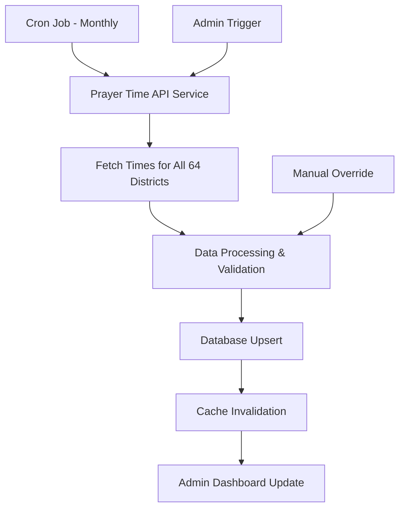
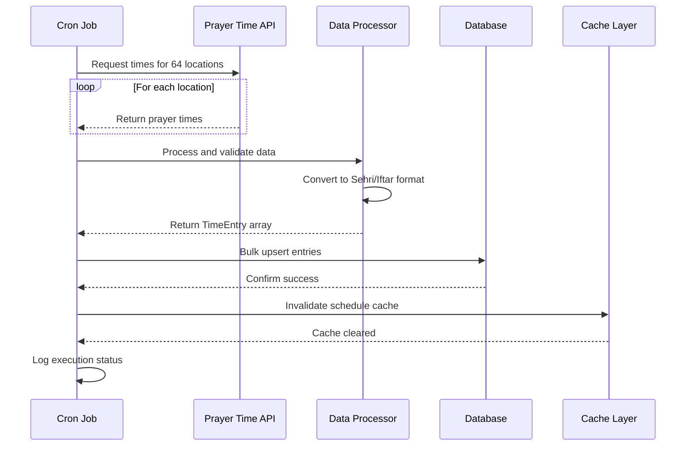

# Automate Sehri & Iftar Times - API Integration Plan

## Overview

This plan outlines the implementation of an automated system for fetching and storing Sehri and Iftar times using the Aladhan API (or similar Islamic prayer time API). The system will automatically update prayer times once per Ramadan month via a scheduled cron job.

## Current System Analysis

### Existing Data Structure
- **Database**: PostgreSQL via Prisma ORM
- **TimeEntry Model**: `id`, `date` (YYYY-MM-DD), `sehri` (HH:mm), `iftar` (HH:mm), `location`, `createdAt`
- **Locations**: 64 Bangladesh districts defined in `lib/config/locations.config.ts`
- **Current Upload Method**: Manual JSON/CSV file upload via admin panel

### Current Limitations
- Manual data entry required for each location
- No automatic updates
- Time-consuming to maintain 64 separate location schedules
- Risk of human error in data entry

## Proposed Solution Architecture



## Implementation Plan

### Phase 1: API Integration Layer

#### 1.1 Create Prayer Time API Service
**File**: `lib/api/prayer-time-api.ts`

**Responsibilities**:
- Interface with Aladhan API (or alternative)
- Handle API rate limiting and retries
- Cache API responses to avoid duplicate calls
- Map API response to internal TimeEntry format

**Key Functions**:
```typescript
interface PrayerTimeAPIService {
  fetchPrayerTimes(
    location: string,
    latitude: number,
    longitude: number,
    month: number,
    year: number
  ): Promise<PrayerTimeData[]>;
  
  fetchAllLocations(
    locations: LocationConfig[],
    month: number,
    year: number
  ): Promise<Map<string, PrayerTimeData[]>>;
}
```

#### 1.2 Add Location Coordinates
**File**: `lib/config/locations.config.ts`

**Changes**:
- Add latitude/longitude coordinates for each of the 64 districts
- Create a lookup map for quick coordinate access

**Example Structure**:
```typescript
export const LOCATION_COORDINATES: Record<District, { lat: number; lng: number }> = {
  'Dhaka': { lat: 23.8103, lng: 90.4125 },
  'Chittagong': { lat: 22.3569, lng: 91.7832 },
  // ... all 64 districts
};
```

### Phase 2: Data Processing & Validation

#### 2.1 Create Data Processor Service
**File**: `lib/services/prayer-time-processor.service.ts`

**Responsibilities**:
- Convert API prayer times to Sehri/Iftar format
- Validate time format (HH:mm)
- Handle timezone conversion (Asia/Dhaka)
- Apply any custom adjustments if needed

**Key Functions**:
```typescript
interface PrayerTimeProcessor {
  convertToSehriIftar(
    apiData: PrayerTimeData,
    location: string
  ): TimeEntry[];
  
  validateTimeEntry(entry: TimeEntry): boolean;
  
  batchProcess(
    apiDataMap: Map<string, PrayerTimeData[]>
  ): TimeEntry[];
}
```

#### 2.2 Update Validation Schema
**File**: `lib/validations/api-schemas.ts`

**Changes**:
- Ensure existing validation schemas work with API-fetched data
- Add any additional validation rules specific to API data

### Phase 3: Database Operations

#### 3.1 Create Bulk Upsert Service
**File**: `features/schedule/services/bulk-upsert.service.ts`

**Responsibilities**:
- Efficiently bulk upsert time entries for all locations
- Handle duplicate detection and updates
- Provide transaction support for data integrity

**Key Functions**:
```typescript
interface BulkUpsertService {
  upsertTimeEntries(
    entries: TimeEntry[]
  ): Promise<BulkUpsertResult>;
  
  upsertForRamadanMonth(
    year: number,
    month: number,
    entries: TimeEntry[]
  ): Promise<BulkUpsertResult>;
}
```

#### 3.2 Update Upload Log
**File**: `lib/db.ts` (or create new service)

**Changes**:
- Extend UploadLog model to track API-based imports
- Add source field: 'manual' | 'api' | 'cron'

### Phase 4: Scheduled Job Implementation

#### 4.1 Create Cron Job Handler
**File**: `lib/cron/prayer-time-cron.ts`

**Responsibilities**:
- Execute monthly prayer time fetch and update
- Handle errors and retries
- Log execution status
- Send notifications on failure

**Key Functions**:
```typescript
interface PrayerTimeCron {
  executeMonthlyUpdate(): Promise<CronExecutionResult>;
  
  executeForSpecificMonth(year: number, month: number): Promise<CronExecutionResult>;
}
```

#### 4.2 Create API Route for Manual Trigger
**File**: `app/api/cron/prayer-times/route.ts`

**Purpose**:
- Allow admin to manually trigger the update process
- Provide status endpoint to check last execution
- Require authentication

**Endpoints**:
- `POST /api/cron/prayer-times` - Trigger manual update
- `GET /api/cron/prayer-times/status` - Get last execution status

### Phase 5: Admin UI Enhancements

#### 5.1 Add Cron Status Widget
**File**: `app/admin/dashboard/page.tsx`

**Changes**:
- Display last successful API update timestamp
- Show next scheduled update time
- Add button to manually trigger update
- Display error status if last update failed

#### 5.2 Add API Configuration Panel
**File**: `app/admin/settings/page.tsx` (new file)

**Features**:
- Configure API endpoint (Aladhan or custom)
- Set calculation method (e.g., ISNA, MWL, etc.)
- Configure adjustment offsets for Sehri/Iftar
- View API usage statistics

### Phase 6: Error Handling & Monitoring

#### 6.1 Create Error Handler
**File**: `lib/errors/prayer-time-error-handler.ts`

**Responsibilities**:
- Handle API failures gracefully
- Implement retry logic with exponential backoff
- Log errors for monitoring
- Send alerts on critical failures

#### 6.2 Add Monitoring Endpoints
**File**: `app/api/health/prayer-times/route.ts`

**Endpoints**:
- Check API connectivity
- Verify data freshness
- Report sync status

### Phase 7: Testing & Documentation

#### 7.1 Unit Tests
- API service tests (mock API responses)
- Data processor tests
- Bulk upsert tests
- Cron job tests

#### 7.2 Integration Tests
- End-to-end API fetch to database flow
- Manual trigger functionality
- Error recovery scenarios

#### 7.3 Documentation Updates
- Update README with automation features
- Document API configuration options
- Add troubleshooting guide
- Document cron job setup for deployment

## Technical Specifications

### Aladhan API Integration

**Base URL**: `http://api.aladhan.com/v1/calendar`

**Endpoint**: `GET /calendar/{year}/{month}?latitude={lat}&longitude={lng}&method=2`

**Parameters**:
- `year`: Year (e.g., 2026)
- `month`: Month (1-12)
- `latitude`: Location latitude
- `longitude`: Location longitude
- `method`: Calculation method (2=ISNA, 3=MWL, etc.)
- `school`: Madhab (0=Shafi, 1=Hanafi)

**Response Mapping**:
- `Fajr` → Sehri (with optional adjustment)
- `Maghrib` → Iftar

**Example Response**:
```json
{
  "data": [
    {
      "date": {
        "readable": "01 Mar 2026",
        "timestamp": "1772361600"
      },
      "timings": {
        "Fajr": "04:45",
        "Dhuhr": "12:15",
        "Asr": "15:45",
        "Maghrib": "18:12",
        "Isha": "19:30"
      }
    }
  ]
}
```

### Environment Variables

Add to `.env`:
```env
# Prayer Time API Configuration
PRAYER_TIME_API_URL=https://api.aladhan.com/v1
PRAYER_TIME_API_METHOD=2
PRAYER_TIME_API_SCHOOL=0
PRAYER_TIME_CRON_SCHEDULE="0 0 1 * *"  # Monthly on 1st day at midnight
PRAYER_TIME_SEHRI_ADJUSTMENT_MINUTES=0
PRAYER_TIME_IFTAR_ADJUSTMENT_MINUTES=0

# Cron Job Configuration
CRON_SECRET_KEY=your-secret-key-for-cron-endpoints
```

### Deployment Considerations

#### Vercel Cron Jobs
- Use Vercel Cron Jobs for scheduled execution
- Configure in `vercel.json`:
```json
{
  "crons": [
    {
      "path": "/api/cron/prayer-times",
      "schedule": "0 0 1 * *"
    }
  ]
}
```

#### Alternative: External Cron Service
- Use GitHub Actions, cron-job.org, or similar
- Call webhook endpoint at scheduled interval

## Data Flow Diagram



## Risk Mitigation

| Risk | Mitigation Strategy |
|------|-------------------|
| API downtime | Implement retry logic with exponential backoff |
| API rate limits | Add delays between location requests, use caching |
| Data inconsistency | Validate all entries before upsert, use transactions |
| Timezone issues | Explicitly handle Asia/Dhaka timezone in all operations |
| API changes | Version API calls, implement fallback to previous version |
| Partial failures | Track successful/failed locations, retry failed ones |

## Success Criteria

- [ ] Automatically fetch Sehri/Iftar times for all 64 districts
- [ ] Update data monthly via scheduled cron job
- [ ] Manual trigger available in admin panel
- [ ] Data validation ensures accuracy
- [ ] Cache invalidation works correctly
- [ ] Error handling and logging in place
- [ ] Admin UI shows sync status
- [ ] Tests cover critical paths
- [ ] Documentation updated

## Estimated Implementation Order

1. **Phase 1**: API Integration Layer (Core functionality)
2. **Phase 2**: Data Processing & Validation
3. **Phase 3**: Database Operations
4. **Phase 4**: Scheduled Job Implementation
5. **Phase 5**: Admin UI Enhancements
6. **Phase 6**: Error Handling & Monitoring
7. **Phase 7**: Testing & Documentation

## Alternative APIs

If Aladhan API is not suitable, consider:

1. **IslamicFinder API** - `https://api.aladhan.com/v1/timings` (same provider, different endpoints)
2. **Prayer Times API** - `https://times.prayer-api.com/`
3. **MuslimSalat API** - `https://muslimsalat.com/`
4. **Custom Calculation** - Use astronomical libraries like `prayer-times` npm package

## Future Enhancements

- Support for multiple calculation methods per location
- Historical data analysis
- User notification system for time changes
- Mobile app integration
- Multi-language support
- Custom time adjustments per district
