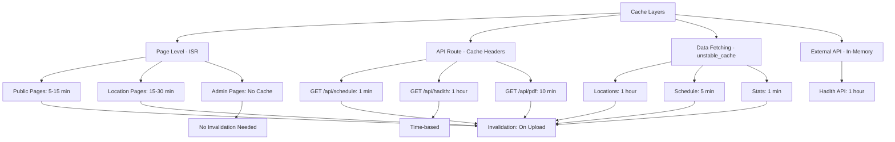

# Cache Implementation Plan

## Executive Summary

This plan outlines a comprehensive caching strategy for the Ramadan Clock application to improve performance, reduce database load, and enhance user experience. The implementation leverages Next.js 15 built-in caching features along with custom cache utilities.

## Current State Analysis

### Existing Caching
- **External API Client**: In-memory caching for hadith API (1 hour TTL)
- **Image Optimization**: Basic caching (60s minimumCacheTTL)
- **Cache Invalidation**: `revalidatePath` used in upload actions

### Gaps Identified
- No page-level caching configured
- No API route caching
- No database query caching
- No cache tags for selective invalidation
- No cache monitoring or cleanup

## Caching Strategy Overview



## Detailed Implementation Plan

### 1. Shared Cache Utilities and Constants

**File**: `lib/cache/cache-config.ts`

Define cache durations and tags as constants for consistency:

```typescript
// Cache durations in seconds
export const CACHE_DURATIONS = {
  SHORT: 60,           // 1 minute - frequently changing data
  MEDIUM: 300,         // 5 minutes - moderately changing data
  LONG: 900,           // 15 minutes - rarely changing data
  VERY_LONG: 3600,     // 1 hour - static data
} as const;

// Cache tags for selective invalidation
export const CACHE_TAGS = {
  SCHEDULE: 'schedule',
  LOCATIONS: 'locations',
  STATS: 'stats',
  HADITH: 'hadith',
  PDF: 'pdf',
} as const;

// Cache configuration for different data types
export const CACHE_CONFIG = {
  locations: {
    duration: CACHE_DURATIONS.VERY_LONG,
    tags: [CACHE_TAGS.LOCATIONS],
  },
  schedule: {
    duration: CACHE_DURATIONS.MEDIUM,
    tags: [CACHE_TAGS.SCHEDULE],
  },
  todaySchedule: {
    duration: CACHE_DURATIONS.SHORT,
    tags: [CACHE_TAGS.SCHEDULE],
  },
  stats: {
    duration: CACHE_DURATIONS.SHORT,
    tags: [CACHE_TAGS.STATS],
  },
  hadith: {
    duration: CACHE_DURATIONS.VERY_LONG,
    tags: [CACHE_TAGS.HADITH],
  },
  pdf: {
    duration: CACHE_DURATIONS.MEDIUM,
    tags: [CACHE_TAGS.PDF],
  },
} as const;
```

**File**: `lib/cache/cache-helpers.ts`

Helper functions for cache operations:

```typescript
import { unstable_cache } from 'next/cache';
import { revalidateTag, revalidatePath } from 'next/cache';
import { CACHE_CONFIG, CACHE_TAGS } from './cache-config';

/**
 * Create a cached version of an async function with tags
 */
export function createCachedFn<T extends (...args: any[]) => Promise<any>>(
  fn: T,
  keyParts: string[],
  config: { duration: number; tags: string[] }
): T {
  return unstable_cache(fn, keyParts, {
    revalidate: config.duration,
    tags: config.tags,
  }) as T;
}

/**
 * Invalidate all schedule-related caches
 */
export function invalidateScheduleCache() {
  revalidateTag(CACHE_TAGS.SCHEDULE);
  revalidateTag(CACHE_TAGS.STATS);
  revalidatePath('/');
  revalidatePath('/calendar');
  revalidatePath('/admin/dashboard');
}

/**
 * Invalidate location caches
 */
export function invalidateLocationCache() {
  revalidateTag(CACHE_TAGS.LOCATIONS);
}

/**
 * Invalidate all caches (for emergency use)
 */
export function invalidateAllCaches() {
  Object.values(CACHE_TAGS).forEach(tag => revalidateTag(tag));
  revalidatePath('/');
  revalidatePath('/calendar');
  revalidatePath('/admin/dashboard');
}

/**
 * Get cache key with prefix
 */
export function getCacheKey(prefix: string, ...parts: (string | number)[]): string {
  return [prefix, ...parts].join(':');
}
```

### 2. Page-Level Caching with ISR

#### Home Page (`app/page.tsx`)

```typescript
export const revalidate = 300; // Revalidate every 5 minutes

// Add cache tags for selective invalidation
export const dynamic = 'force-static';
export const fetchCache = 'force-cache';
```

#### Calendar Page (`app/(home)/calendar/page.tsx`)

```typescript
export const revalidate = 900; // Revalidate every 15 minutes
export const dynamic = 'force-static';
export const fetchCache = 'force-cache';
```

#### Location Pages (`app/(home)/location/[city]/page.tsx`)

```typescript
export const revalidate = 1800; // Revalidate every 30 minutes
export const dynamic = 'force-static';
export const fetchCache = 'force-cache';

// Keep generateStaticParams for pre-rendering
export async function generateStaticParams() {
  const locations = await getLocations();
  return locations.map((location) => ({ city: encodeURIComponent(location) }));
}
```

#### Admin Pages - No Caching

```typescript
export const dynamic = 'force-dynamic';
export const revalidate = 0;
```

### 3. API Route Caching

#### Schedule API (`app/api/schedule/route.ts`)

```typescript
export const dynamic = 'force-dynamic';

// Add cache headers for GET requests
async function getScheduleHandler(request: NextRequest): Promise<NextResponse> {
  // ... existing code ...
  
  return paginated(entries, pagination, {
    headers: {
      'Cache-Control': 'public, s-maxage=60, stale-while-revalidate=300',
      'CDN-Cache-Control': 'public, s-maxage=60, stale-while-revalidate=300',
    },
  });
}
```

#### Hadith API (`app/api/hadith/route.ts`)

```typescript
export const dynamic = 'force-dynamic';

async function getHadithHandler(request: NextRequest): Promise<NextResponse> {
  // ... existing code ...
  
  return success(hadith, {
    headers: {
      'Cache-Control': 'public, s-maxage=3600, stale-while-revalidate=7200',
      'CDN-Cache-Control': 'public, s-maxage=3600, stale-while-revalidate=7200',
    },
  });
}
```

#### PDF API (`app/api/pdf/route.ts`)

```typescript
export const dynamic = 'force-dynamic';

async function generatePdfHandler(request: NextRequest): Promise<NextResponse> {
  // ... existing code ...
  
  const response = new NextResponse(pdfBuffer, {
    status: 200,
    headers: {
      'Content-Type': 'application/pdf',
      'Content-Disposition': `attachment; filename="${filename}"`,
      'Content-Length': pdfBuffer.byteLength.toString(),
      'Cache-Control': 'public, s-maxage=600, stale-while-revalidate=1800',
      'ETag': generateETag(schedule), // Add ETag for conditional requests
    },
  });
  
  return response;
}
```

### 4. Data Fetching Cache for Server Actions

#### Update `actions/time-entries.ts`

```typescript
import { unstable_cache } from 'next/cache';
import { createCachedFn, CACHE_CONFIG } from '@/lib/cache';

// Cached version of getLocations
export const getLocations = createCachedFn(
  async (): Promise<string[]> => {
    try {
      const result = await prisma.timeEntry.groupBy({
        by: ["location"],
        where: {
          location: { not: null },
        },
      });

      return result.map((r) => r.location!).filter(Boolean);
    } catch (error) {
      console.error("Error fetching locations:", error);
      return [];
    }
  },
  ['locations'],
  CACHE_CONFIG.locations
);

// Cached version of getTodaySchedule
export const getTodaySchedule = createCachedFn(
  async (location?: string | null): Promise<TimeEntry | null> => {
    try {
      const today = moment().format('YYYY-MM-DD');

      const where: Record<string, unknown> = {
        date: today,
      };

      if (location) {
        where.location = location;
      }

      const entry = await prisma.timeEntry.findFirst({
        where,
      });

      return entry ? formatTimeEntry(entry) : null;
    } catch (error) {
      console.error("Error fetching today's schedule:", error);
      return null;
    }
  },
  ['today-schedule'],
  CACHE_CONFIG.todaySchedule
);

// Cached version of getFullSchedule
export const getFullSchedule = createCachedFn(
  async (location?: string | null): Promise<FormattedTimeEntry[]> => {
    try {
      const where = location ? { location } : {};

      const entries = await prisma.timeEntry.findMany({
        where,
        orderBy: { date: "asc" },
      });

      return entries.map(formatTimeEntry);
    } catch (error) {
      console.error("Error fetching full schedule:", error);
      return [];
    }
  },
  ['full-schedule'],
  CACHE_CONFIG.schedule
);

// Cached version of getStats
export const getStats = createCachedFn(
  async () => {
    try {
      const [totalEntries, locations, recentUploads] = await Promise.all([
        prisma.timeEntry.count(),
        prisma.timeEntry.groupBy({
          by: ["location"],
          where: {
            location: { not: null },
          },
        }),
        prisma.uploadLog.findMany({
          take: 5,
          orderBy: { uploadedAt: "desc" },
        }),
      ]);

      return {
        totalEntries,
        totalLocations: locations.length,
        recentUploads,
      };
    } catch (error) {
      console.error("Error fetching stats:", error);
      return {
        totalEntries: 0,
        totalLocations: 0,
        recentUploads: [],
      };
    }
  },
  ['stats'],
  CACHE_CONFIG.stats
);
```

### 5. Cache Invalidation Hooks

#### Update `actions/time-entries.ts` - Add invalidation to mutations

```typescript
import { invalidateScheduleCache, invalidateLocationCache } from '@/lib/cache';

export async function deleteTimeEntry(id: string): Promise<{ success: boolean; error?: string }> {
  try {
    await prisma.timeEntry.delete({
      where: { id },
    });

    // Invalidate caches
    invalidateScheduleCache();
    invalidateLocationCache();

    return { success: true };
  } catch (error) {
    console.error("Error deleting time entry:", error);
    return { success: false, error: "Failed to delete entry" };
  }
}

export async function updateTimeEntry(
  id: string,
  data: { date?: string; sehri?: string; iftar?: string; location?: string | null }
): Promise<{ success: boolean; error?: string }> {
  try {
    await prisma.timeEntry.update({
      where: { id },
      data,
    });

    // Invalidate caches
    invalidateScheduleCache();
    invalidateLocationCache();

    return { success: true };
  } catch (error) {
    console.error("Error updating time entry:", error);
    return { success: false, error: "Failed to update entry" };
  }
}
```

#### Update `actions/upload.actions.new.ts`

```typescript
import { invalidateScheduleCache, invalidateLocationCache } from '@/lib/cache';

export async function uploadSchedule(
  entries: Array<{ date: string; sehri: string; iftar: string; location?: string | null }>,
  fileName: string
): Promise<ActionResult> {
  try {
    await requireAdminSession();
    batchTimeEntrySchema.parse({ entries });

    const result = await uploadScheduleUseCase.upload(entries, fileName);

    if (result.success) {
      // Invalidate caches
      invalidateScheduleCache();
      invalidateLocationCache();

      // Also revalidate paths for Next.js ISR
      revalidatePath('/');
      revalidatePath('/calendar');
      revalidatePath('/admin/dashboard');

      logger.info('Schedule uploaded successfully', {
        fileName,
        entriesCount: entries.length,
      });
    }

    return {
      success: true,
      data: result,
    };
  } catch (error) {
    // ... error handling ...
  }
}
```

#### Update API Routes for Cache Invalidation

**File**: `app/api/schedule/[id]/route.ts`

```typescript
import { invalidateScheduleCache, invalidateLocationCache } from '@/lib/cache';

async function updateScheduleHandler(
  request: NextRequest,
  { params }: { params: Promise<{ id: string }> }
): Promise<NextResponse> {
  try {
    const { id } = await params;
    const body = await request.json();
    const data = timeEntryUpdateSchema.parse(body);

    const entry = await prisma.timeEntry.update({
      where: { id },
      data,
    });

    // Invalidate caches
    invalidateScheduleCache();
    invalidateLocationCache();

    return success(entry);
  } catch (err) {
    // ... error handling ...
  }
}

async function deleteScheduleHandler(
  request: NextRequest,
  { params }: { params: Promise<{ id: string }> }
): Promise<NextResponse> {
  try {
    const { id } = await params;

    await prisma.timeEntry.delete({
      where: { id },
    });

    // Invalidate caches
    invalidateScheduleCache();
    invalidateLocationCache();

    return success({ message: 'Entry deleted successfully' }, 200);
  } catch (err) {
    // ... error handling ...
  }
}
```

### 6. Update Next.js Config with Cache Headers

**File**: `next.config.ts`

```typescript
import type { NextConfig } from "next";

const nextConfig: NextConfig = {
  // SEO-friendly settings
  compress: true,
  poweredByHeader: false,
  
  // Image optimization
  images: {
    remotePatterns: [
      {
        protocol: 'https',
        hostname: '**',
      },
    ],
    formats: ['image/avif', 'image/webp'],
    minimumCacheTTL: 60,
  },
  
  // Cache headers for static assets
  async headers() {
    return [
      {
        source: '/(.*)',
        headers: [
          {
            key: 'X-Frame-Options',
            value: 'DENY',
          },
          {
            key: 'X-Content-Type-Options',
            value: 'nosniff',
          },
          {
            key: 'Referrer-Policy',
            value: 'strict-origin-when-cross-origin',
          },
        ],
      },
      {
        source: '/static/:path*',
        headers: [
          {
            key: 'Cache-Control',
            value: 'public, max-age=31536000, immutable',
          },
        ],
      },
      {
        source: '/_next/static/:path*',
        headers: [
          {
            key: 'Cache-Control',
            value: 'public, max-age=31536000, immutable',
          },
        ],
      },
      {
        source: '/images/:path*',
        headers: [
          {
            key: 'Cache-Control',
            value: 'public, max-age=86400, stale-while-revalidate=604800',
          },
        ],
      },
    ];
  },
};

export default nextConfig;
```

### 7. Cache Monitoring and Cleanup Utilities

**File**: `lib/cache/cache-monitor.ts`

```typescript
import { logger } from '@/lib/logger';

/**
 * Cache monitoring utilities
 */
export class CacheMonitor {
  private static metrics: Map<string, { hits: number; misses: number; lastReset: Date }> = new Map();

  /**
   * Record a cache hit
   */
  static recordHit(key: string): void {
    const metric = this.metrics.get(key) || { hits: 0, misses: 0, lastReset: new Date() };
    metric.hits++;
    this.metrics.set(key, metric);
  }

  /**
   * Record a cache miss
   */
  static recordMiss(key: string): void {
    const metric = this.metrics.get(key) || { hits: 0, misses: 0, lastReset: new Date() };
    metric.misses++;
    this.metrics.set(key, metric);
  }

  /**
   * Get cache statistics
   */
  static getStats(): Record<string, { hits: number; misses: number; hitRate: number }> {
    const stats: Record<string, any> = {};
    
    for (const [key, metric] of this.metrics.entries()) {
      const total = metric.hits + metric.misses;
      const hitRate = total > 0 ? (metric.hits / total) * 100 : 0;
      
      stats[key] = {
        hits: metric.hits,
        misses: metric.misses,
        hitRate: hitRate.toFixed(2) + '%',
      };
    }
    
    return stats;
  }

  /**
   * Log cache statistics
   */
  static logStats(): void {
    const stats = this.getStats();
    logger.info('Cache statistics', { stats });
  }

  /**
   * Reset metrics
   */
  static resetMetrics(): void {
    this.metrics.clear();
    logger.info('Cache metrics reset');
  }

  /**
   * Get metrics for a specific key
   */
  static getKeyStats(key: string): { hits: number; misses: number; hitRate: string } | null {
    const metric = this.metrics.get(key);
    if (!metric) return null;

    const total = metric.hits + metric.misses;
    const hitRate = total > 0 ? (metric.hits / total) * 100 : 0;

    return {
      hits: metric.hits,
      misses: metric.misses,
      hitRate: hitRate.toFixed(2) + '%',
    };
  }
}

/**
 * Wrap a function with cache monitoring
 */
export function withCacheMonitoring<T extends (...args: any[]) => Promise<any>>(
  fn: T,
  cacheKey: string
): T {
  return (async (...args: any[]) => {
    try {
      const result = await fn(...args);
      CacheMonitor.recordHit(cacheKey);
      return result;
    } catch (error) {
      CacheMonitor.recordMiss(cacheKey);
      throw error;
    }
  }) as T;
}
```

**File**: `lib/cache/cache-cleanup.ts`

```typescript
import { logger } from '@/lib/logger';
import { getGlobalApiClient } from '@/lib/api';

/**
 * Cache cleanup utilities
 */
export class CacheCleanup {
  /**
   * Clean up expired cache entries in external API client
   */
  static async cleanupExternalApiCache(): Promise<void> {
    try {
      const client = getGlobalApiClient();
      client.cleanupCache();
      logger.info('External API cache cleaned up');
    } catch (error) {
      logger.error('Failed to cleanup external API cache', {}, error as Error);
    }
  }

  /**
   * Schedule periodic cache cleanup
   */
  static schedulePeriodicCleanup(intervalMs: number = 3600000): NodeJS.Timeout {
    return setInterval(() => {
      this.cleanupExternalApiCache();
      logger.info('Periodic cache cleanup completed');
    }, intervalMs);
  }
}

// Initialize periodic cleanup on module import
if (typeof window === 'undefined') {
  CacheCleanup.schedulePeriodicCleanup(3600000); // Every hour
}
```

### 8. Cache Debugging API Endpoint

**File**: `app/api/cache/debug/route.ts` (Admin only)

```typescript
import { NextRequest, NextResponse } from 'next/server';
import { withErrorHandler, withAuth, success, error } from '@/lib/api';
import { CacheMonitor } from '@/lib/cache/cache-monitor';
import { getGlobalApiClient } from '@/lib/api';

async function getCacheDebugHandler(request: NextRequest): Promise<NextResponse> {
  try {
    const stats = CacheMonitor.getStats();
    const externalApiStats = getGlobalApiClient().getCacheStats();

    return success({
      applicationCache: stats,
      externalApiCache: externalApiStats,
    });
  } catch (err) {
    return error(500, 'CacheDebugError', 'Failed to get cache debug info');
  }
}

export const GET = withErrorHandler(
  withAuth(getCacheDebugHandler, { requireAdmin: true })
);
```

## Implementation Order

1. **Phase 1: Foundation** (Create cache utilities)
   - Create `lib/cache/cache-config.ts`
   - Create `lib/cache/cache-helpers.ts`
   - Create `lib/cache/cache-monitor.ts`
   - Create `lib/cache/cache-cleanup.ts`

2. **Phase 2: Page-Level Caching** (Add ISR to pages)
   - Update `app/page.tsx`
   - Update `app/(home)/calendar/page.tsx`
   - Update `app/(home)/location/[city]/page.tsx`
   - Update admin pages to disable caching

3. **Phase 3: API Route Caching** (Add cache headers)
   - Update `app/api/schedule/route.ts`
   - Update `app/api/hadith/route.ts`
   - Update `app/api/pdf/route.ts`

4. **Phase 4: Data Fetching Cache** (Cache server actions)
   - Update `actions/time-entries.ts` with cached functions

5. **Phase 5: Cache Invalidation** (Add invalidation hooks)
   - Update mutation functions in `actions/time-entries.ts`
   - Update `actions/upload.actions.new.ts`
   - Update API route mutations

6. **Phase 6: Config and Monitoring** (Final touches)
   - Update `next.config.ts`
   - Create cache debug API endpoint
   - Add monitoring to critical paths

## Testing Strategy

### Unit Tests
- Test cache helper functions
- Test cache invalidation logic
- Test cache key generation

### Integration Tests
- Test page revalidation
- Test API cache headers
- Test server action caching
- Test cache invalidation on mutations

### Load Testing
- Measure performance improvements
- Monitor cache hit rates
- Verify cache invalidation works correctly

## Monitoring and Metrics

### Key Metrics to Track
- Cache hit rate per endpoint
- Average response time (with vs without cache)
- Database query reduction
- CDN cache hit rate

### Logging
- Log cache hits/misses for critical paths
- Log cache invalidation events
- Log cache cleanup operations

## Security Considerations

1. **Admin Pages**: Never cache admin pages
2. **Authenticated Routes**: Use user-specific cache keys
3. **Sensitive Data**: Never cache sensitive information
4. **Cache Poisoning**: Validate all cached data
5. **Rate Limiting**: Keep rate limiting even with caching

## Rollback Plan

If issues arise:
1. Set all `revalidate` values to `0`
2. Remove `unstable_cache` wrappers
3. Remove cache headers from API routes
4. Clear all caches via debug endpoint

## Success Criteria

- [ ] Page load time reduced by 40%+
- [ ] Database queries reduced by 60%+
- [ ] Cache hit rate > 80% for static content
- [ ] Cache invalidation works correctly on data changes
- [ ] No stale data displayed to users
- [ ] Admin pages remain uncached and real-time
