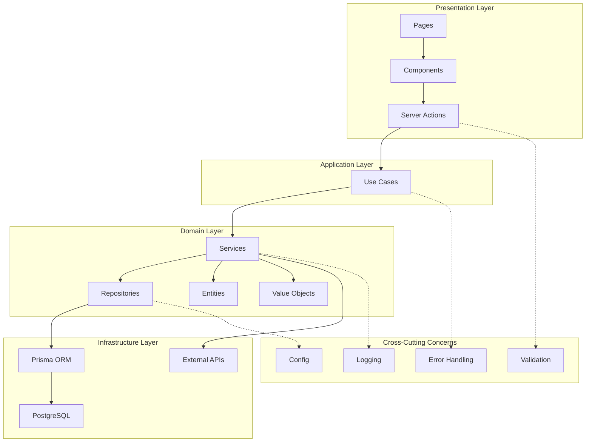

# Codebase Refactoring Plan
## Clean Code, SOLID Principles & Modular Approach

> **Project**: Ramadan Clock - Sehri & Iftar Time Viewer  
> **Framework**: Next.js 16 (App Router)  
> **Date**: 2025-02-19

---

## Executive Summary

This document outlines a comprehensive refactoring plan to enforce clean code principles, SOLID design patterns, and modular architecture following Next.js best practices. The current codebase has several areas for improvement including code duplication, lack of separation of concerns, and violations of SOLID principles.

---

## 1. Current State Analysis

### 1.1 Identified Issues

#### Clean Code Violations

| Issue | Location | Severity |
|-------|----------|----------|
| Large files (>250 lines) | `app/page.tsx`, `app/(home)/calendar/page.tsx`, `app/admin/upload/page.tsx`, `components/admin/calendar-view.tsx` | High |
| Magic numbers and strings | Throughout codebase (1000 rows, 1MB, color values) | Medium |
| Duplicate time parsing logic | `app/(home)/calendar/page.tsx:177-238`, `components/admin/calendar-view.tsx:204-266` | High |
| Complex functions doing too much | `actions/upload.ts:uploadSchedule`, `actions/upload.ts:validateScheduleFile` | High |
| Generic error handling | All try-catch blocks | Medium |
| Inconsistent naming conventions | Mixed camelCase, snake_case in database | Low |
| Missing abstraction layers | Direct Prisma calls everywhere | High |
| Using `any` types | `app/api/pdf/route.ts:21,66` | Medium |

#### SOLID Principle Violations

| Principle | Violation | Location |
|-----------|-----------|----------|
| **Single Responsibility (SRP)** | `actions/time-entries.ts` - data fetching + time formatting + status calculation | Multiple functions |
| **Single Responsibility (SRP)** | `actions/upload.ts` - file parsing + validation + DB operations | `uploadSchedule`, `validateScheduleFile` |
| **Single Responsibility (SRP)** | `app/(home)/calendar/page.tsx` - UI + business logic for time status | Lines 171-238 |
| **Open/Closed (OCP)** | Hard-coded file types (JSON, CSV) - not extensible | `app/admin/upload/page.tsx` |
| **Open/Closed (OCP)** | Hard-coded Bangladesh districts list | `components/admin/calendar-view.tsx:43-66` |
| **Interface Segregation (ISP)** | `TimeEntry` type used everywhere with unnecessary fields | Multiple locations |
| **Dependency Inversion (DIP)** | Direct Prisma dependency throughout | All actions |
| **Dependency Inversion (DIP)** | Hard-coded API URLs | `lib/hadith-api.ts` |

#### Next.js Best Practices Violations

| Best Practice | Violation | Location |
|---------------|-----------|----------|
| Server Actions error handling | No proper error types | All server actions |
| Data fetching caching | No proper caching strategy | `lib/hadith-api.ts` |
| Type safety | Using `any` types | `app/api/pdf/route.ts` |
| Component organization | Not feature-based | Current structure |
| API Routes | PDF generation should be server action | `app/api/pdf/route.ts` |
| Error boundaries | No error boundaries | None |
| Environment variables | No validation | All `.env` usage |
| Database queries | Potential N+1 queries | `actions/time-entries.ts` |

#### Modular Approach Issues

| Issue | Description |
|-------|-------------|
| No clear separation of concerns | Business logic mixed with UI |
| No service layer | Direct database access from actions |
| No repository pattern | Prisma queries scattered |
| No centralized error handling | Individual try-catch blocks |
| No proper logging | Only console.error |
| No configuration management | Hard-coded values everywhere |

---

## 2. Proposed Architecture

### 2.1 New Folder Structure

```
ramadan-clock/
├── app/
│   ├── (home)/
│   │   ├── calendar/
│   │   │   └── page.tsx
│   │   ├── location/
│   │   │   └── [city]/
│   │   │       └── page.tsx
│   │   └── layout.tsx
│   ├── admin/
│   │   ├── dashboard/
│   │   │   └── page.tsx
│   │   ├── upload/
│   │   │   └── page.tsx
│   │   └── layout.tsx
│   ├── auth/
│   │   └── login/
│   │       └── page.tsx
│   ├── contact/
│   │   └── page.tsx
│   ├── layout.tsx
│   └── page.tsx
├── components/
│   ├── admin/
│   │   ├── calendar-view/
│   │   │   ├── index.tsx
│   │   │   ├── calendar-table.tsx
│   │   │   ├── entry-actions.tsx
│   │   │   └── status-badge.tsx
│   │   └── upload/
│   │       ├── index.tsx
│   │       ├── drop-zone.tsx
│   │       ├── validation-status.tsx
│   │       └── preview-table.tsx
│   ├── public/
│   │   ├── schedule-cards/
│   │   │   ├── index.tsx
│   │   │   ├── sehri-card.tsx
│   │   │   └── iftar-card.tsx
│   │   ├── hadith-card.tsx
│   │   ├── quick-links.tsx
│   │   └── skeletons/
│   ├── shared/
│   │   ├── header/
│   │   │   ├── index.tsx
│   │   │   ├── desktop-nav.tsx
│   │   │   └── mobile-nav.tsx
│   │   ├── footer.tsx
│   │   ├── theme-toggle.tsx
│   │   ├── logout-button.tsx
│   │   ├── download-button.tsx
│   │   └── countdown-timer.tsx
│   └── ui/ (shadcn components)
├── features/
│   ├── schedule/
│   │   ├── domain/
│   │   │   ├── entities/
│   │   │   │   ├── time-entry.entity.ts
│   │   │   │   └── upload-log.entity.ts
│   │   │   ├── value-objects/
│   │   │   │   ├── date.vo.ts
│   │   │   │   ├── time.vo.ts
│   │   │   │   └── location.vo.ts
│   │   │   └── types/
│   │   │       ├── schedule-status.types.ts
│   │   │       └── time-entry.types.ts
│   │   ├── repositories/
│   │   │   ├── time-entry.repository.ts
│   │   │   ├── upload-log.repository.ts
│   │   │   └── index.ts
│   │   ├── services/
│   │   │   ├── schedule.service.ts
│   │   │   ├── time-calculator.service.ts
│   │   │   ├── upload.service.ts
│   │   │   └── pdf.service.ts
│   │   └── use-cases/
│   │       ├── get-today-schedule.use-case.ts
│   │       ├── get-full-schedule.use-case.ts
│   │       ├── get-locations.use-case.ts
│   │       ├── upload-schedule.use-case.ts
│   │       ├── update-entry.use-case.ts
│   │       ├── delete-entry.use-case.ts
│   │       └── index.ts
│   ├── auth/
│   │   ├── domain/
│   │   │   └── entities/
│   │   │       └── admin-user.entity.ts
│   │   ├── services/
│   │   │   └── auth.service.ts
│   │   └── use-cases/
│   │       ├── login.use-case.ts
│   │       └── get-session.use-case.ts
│   └── hadith/
│       ├── services/
│       │   └── hadith.service.ts
│       └── use-cases/
│           └── get-random-hadith.use-case.ts
├── lib/
│   ├── config/
│   │   ├── index.ts
│   │   ├── app.config.ts
│   │   ├── upload.config.ts
│   │   └── locations.config.ts
│   ├── db/
│   │   ├── prisma.ts
│   │   └── connection.ts
│   ├── errors/
│   │   ├── index.ts
│   │   ├── app-error.ts
│   │   ├── database-error.ts
│   │   ├── validation-error.ts
│   │   └── not-found-error.ts
│   ├── parsers/
│   │   ├── index.ts
│   │   ├── json-parser.ts
│   │   ├── csv-parser.ts
│   │   └── parser.interface.ts
│   ├── utils/
│   │   ├── index.ts
│   │   ├── cn.ts
│   │   ├── date.utils.ts
│   │   └── time.utils.ts
│   ├── logger/
│   │   ├── index.ts
│   │   └── logger.ts
│   ├── validators/
│   │   ├── index.ts
│   │   └── schema.validators.ts
│   ├── auth-config.ts
│   └── auth.ts
├── actions/
│   ├── schedule.actions.ts
│   ├── upload.actions.ts
│   └── auth.actions.ts
├── types/
│   └── global.d.ts
└── prisma/
    ├── schema.prisma
    └── seed.ts
```

### 2.2 Architecture Diagram



---

## 3. Detailed Refactoring Steps

### Phase 1: Foundation & Infrastructure (Priority: High)

#### 3.1 Create Configuration Management

**File**: `lib/config/index.ts`
```typescript
export const APP_CONFIG = {
  name: 'Ramadan Clock',
  version: '0.1.0',
  timezone: 'Asia/Dhaka',
} as const;

export const UPLOAD_CONFIG = {
  maxFileSize: 1024 * 1024, // 1MB
  maxRows: 1000,
  allowedFileTypes: ['application/json', 'text/csv'],
  allowedExtensions: ['.json', '.csv'],
} as const;

export const TIME_CONFIG = {
  countdownThresholdMinutes: 60,
  defaultSehriTime: '04:30',
  defaultIftarTime: '18:00',
} as const;
```

**File**: `lib/config/locations.config.ts`
```typescript
export const BANGLADESH_DISTRICTS = [
  // Barisal Division
  'Barguna', 'Barisal', 'Bhola', 'Jhalokati', 'Patuakhali', 'Pirojpur',
  // ... (rest of districts)
] as const;

export type District = typeof BANGLADESH_DISTRICTS[number];
```

#### 3.2 Create Error Handling System

**File**: `lib/errors/app-error.ts`
```typescript
export abstract class AppError extends Error {
  abstract readonly statusCode: number;
  abstract readonly isOperational: boolean;

  constructor(message: string, public readonly cause?: Error) {
    super(message);
    this.name = this.constructor.name;
    Error.captureStackTrace(this, this.constructor);
  }
}

export class DatabaseError extends AppError {
  readonly statusCode = 500;
  readonly isOperational = false;
  constructor(message: string = 'Database operation failed', cause?: Error) {
    super(message, cause);
  }
}

export class ValidationError extends AppError {
  readonly statusCode = 400;
  readonly isOperational = true;
  constructor(message: string, public readonly field?: string) {
    super(message);
  }
}

export class NotFoundError extends AppError {
  readonly statusCode = 404;
  readonly isOperational = true;
  constructor(resource: string, identifier?: string) {
    super(`${resource}${identifier ? ` (${identifier})` : ''} not found`);
  }
}

export class UnauthorizedError extends AppError {
  readonly statusCode = 401;
  readonly isOperational = true;
  constructor(message: string = 'Unauthorized access') {
    super(message);
  }
}
```

#### 3.3 Create Logging System

**File**: `lib/logger/logger.ts`
```typescript
type LogLevel = 'error' | 'warn' | 'info' | 'debug';

interface LogEntry {
  level: LogLevel;
  message: string;
  context?: Record<string, unknown>;
  timestamp: Date;
  error?: Error;
}

class Logger {
  private isDevelopment = process.env.NODE_ENV === 'development';

  private format(entry: LogEntry): string {
    const { level, message, context, error } = entry;
    const contextStr = context ? ` ${JSON.stringify(context)}` : '';
    const errorStr = error ? `\n${error.stack}` : '';
    return `[${entry.timestamp.toISOString()}] ${level.toUpperCase()}: ${message}${contextStr}${errorStr}`;
  }

  private log(level: LogLevel, message: string, context?: Record<string, unknown>, error?: Error) {
    const entry: LogEntry = {
      level,
      message,
      context,
      timestamp: new Date(),
      error,
    };

    if (this.isDevelopment) {
      console.log(this.format(entry));
    } else {
      // In production, send to external logging service
      // e.g., Sentry, Datadog, etc.
    }
  }

  error(message: string, context?: Record<string, unknown>, error?: Error) {
    this.log('error', message, context, error);
  }

  warn(message: string, context?: Record<string, unknown>) {
    this.log('warn', message, context);
  }

  info(message: string, context?: Record<string, unknown>) {
    this.log('info', message, context);
  }

  debug(message: string, context?: Record<string, unknown>) {
    this.log('debug', message, context);
  }
}

export const logger = new Logger();
```

#### 3.4 Create Utility Functions

**File**: `lib/utils/time.utils.ts`
```typescript
export interface ParsedTime {
  hours: number;
  minutes: number;
}

export function parseTime(timeStr: string): ParsedTime {
  const [hours, minutes] = timeStr.split(':').map(Number);
  return { hours, minutes };
}

export function formatTime12Hour(time24: string): string {
  const { hours, minutes } = parseTime(time24);
  const period = hours >= 12 ? 'PM' : 'AM';
  const hours12 = hours % 12 || 12;
  return `${hours12}:${minutes.toString().padStart(2, '0')} ${period}`;
}

export function createTimeDate(timeStr: string, date: Date = new Date()): Date {
  const { hours, minutes } = parseTime(timeStr);
  const result = new Date(date);
  result.setHours(hours, minutes, 0, 0);
  return result;
}

export function hasTimePassed(timeStr: string, referenceDate: Date = new Date()): boolean {
  const targetTime = createTimeDate(timeStr, referenceDate);
  return referenceDate >= targetTime;
}
```

**File**: `lib/utils/date.utils.ts`
```typescript
export function formatDate(date: Date, format: 'iso' | 'display' = 'iso'): string {
  if (format === 'iso') {
    return date.toISOString().split('T')[0];
  }
  return date.toLocaleDateString('en-US', {
    weekday: 'long',
    year: 'numeric',
    month: 'long',
    day: 'numeric',
  });
}

export function isToday(date: Date): boolean {
  const today = new Date();
  return date.toDateString() === today.toDateString();
}

export function isTomorrow(date: Date): boolean {
  const tomorrow = new Date();
  tomorrow.setDate(tomorrow.getDate() + 1);
  return date.toDateString() === tomorrow.toDateString();
}

export function isPast(date: Date): boolean {
  const today = new Date();
  today.setHours(0, 0, 0, 0);
  return date < today;
}

export function addDays(date: Date, days: number): Date {
  const result = new Date(date);
  result.setDate(result.getDate() + days);
  return result;
}
```

---

### Phase 2: Domain Layer (Priority: High)

#### 3.5 Create Value Objects

**File**: `features/schedule/domain/value-objects/date.vo.ts`
```typescript
export class DateVO {
  private readonly _value: string;

  constructor(value: string) {
    if (!this.isValid(value)) {
      throw new Error('Invalid date format. Expected YYYY-MM-DD');
    }
    this._value = value;
  }

  private isValid(value: string): boolean {
    return /^\d{4}-\d{2}-\d{2}$/.test(value);
  }

  get value(): string {
    return this._value;
  }

  toDate(): Date {
    return new Date(this._value);
  }

  equals(other: DateVO): boolean {
    return this._value === other._value;
  }

  isToday(): boolean {
    return this.toDate().toDateString() === new Date().toDateString();
  }

  isTomorrow(): boolean {
    const tomorrow = new Date();
    tomorrow.setDate(tomorrow.getDate() + 1);
    return this.toDate().toDateString() === tomorrow.toDateString();
  }

  isPast(): boolean {
    const today = new Date();
    today.setHours(0, 0, 0, 0);
    return this.toDate() < today;
  }
}
```

**File**: `features/schedule/domain/value-objects/time.vo.ts`
```typescript
import { createTimeDate, hasTimePassed } from '@/lib/utils/time.utils';

export class TimeVO {
  private readonly _value: string;

  constructor(value: string) {
    if (!this.isValid(value)) {
      throw new Error('Invalid time format. Expected HH:mm');
    }
    this._value = value;
  }

  private isValid(value: string): boolean {
    return /^\d{2}:\d{2}$/.test(value);
  }

  get value(): string {
    return this._value;
  }

  to12HourFormat(): string {
    const [hours, minutes] = this._value.split(':').map(Number);
    const period = hours >= 12 ? 'PM' : 'AM';
    const hours12 = hours % 12 || 12;
    return `${hours12}:${minutes.toString().padStart(2, '0')} ${period}`;
  }

  hasPassed(referenceDate: Date = new Date()): boolean {
    return hasTimePassed(this._value, referenceDate);
  }

  toDate(date: Date = new Date()): Date {
    return createTimeDate(this._value, date);
  }

  equals(other: TimeVO): boolean {
    return this._value === other._value;
  }
}
```

**File**: `features/schedule/domain/value-objects/location.vo.ts`
```typescript
export class LocationVO {
  private readonly _value: string | null;

  constructor(value: string | null) {
    this._value = value || null;
  }

  get value(): string | null {
    return this._value;
  }

  get displayName(): string {
    return this._value || 'All Locations';
  }

  isEmpty(): boolean {
    return this._value === null || this._value.trim() === '';
  }

  equals(other: LocationVO): boolean {
    return this._value === other._value;
  }

  static create(value: string | null | undefined): LocationVO {
    return new LocationVO(value || null);
  }
}
```

#### 3.6 Create Domain Entities

**File**: `features/schedule/domain/entities/time-entry.entity.ts`
```typescript
import { DateVO } from '../value-objects/date.vo';
import { TimeVO } from '../value-objects/time.vo';
import { LocationVO } from '../value-objects/location.vo';

export interface TimeEntryDTO {
  id: string;
  date: string;
  sehri: string;
  iftar: string;
  location: string | null;
}

export class TimeEntry {
  readonly id: string;
  readonly date: DateVO;
  readonly sehri: TimeVO;
  readonly iftar: TimeVO;
  readonly location: LocationVO;

  constructor(dto: TimeEntryDTO) {
    this.id = dto.id;
    this.date = new DateVO(dto.date);
    this.sehri = new TimeVO(dto.sehri);
    this.iftar = new TimeVO(dto.iftar);
    this.location = new LocationVO(dto.location);
  }

  toDTO(): TimeEntryDTO {
    return {
      id: this.id,
      date: this.date.value,
      sehri: this.sehri.value,
      iftar: this.iftar.value,
      location: this.location.value,
    };
  }

  toFormattedDTO(): TimeEntryDTO {
    return {
      id: this.id,
      date: this.date.value,
      sehri: this.sehri.to12HourFormat(),
      iftar: this.iftar.to12HourFormat(),
      location: this.location.value,
    };
  }

  isSehriPassed(referenceDate?: Date): boolean {
    return this.sehri.hasPassed(referenceDate);
  }

  isIftarPassed(referenceDate?: Date): boolean {
    return this.iftar.hasPassed(referenceDate);
  }

  isPast(): boolean {
    return this.date.isPast();
  }

  isToday(): boolean {
    return this.date.isToday();
  }

  isTomorrow(): boolean {
    return this.date.isTomorrow();
  }
}
```

#### 3.7 Create Domain Types

**File**: `features/schedule/domain/types/schedule-status.types.ts`
```typescript
export type ScheduleStatus = 'passed' | 'today' | 'tomorrow' | 'upcoming';

export interface ScheduleStatusInfo {
  status: ScheduleStatus;
  statusText: string;
  rowClass: string;
}

export interface ScheduleDisplayData {
  today: TimeEntry | null;
  tomorrow: TimeEntry | null;
  sehriPassed: boolean;
  iftarPassed: boolean;
}
```

---

### Phase 3: Data Layer (Priority: High)

#### 3.8 Create Repository Pattern

**File**: `features/schedule/repositories/time-entry.repository.ts`
```typescript
import { prisma } from '@/lib/db';
import { logger } from '@/lib/logger';
import { DatabaseError, NotFoundError } from '@/lib/errors';
import type { TimeEntryDTO } from '../domain/entities/time-entry.entity';

export interface ITimeEntryRepository {
  findByDate(date: string, location?: string | null): Promise<TimeEntryDTO | null>;
  findByDateRange(startDate: string, endDate: string, location?: string | null): Promise<TimeEntryDTO[]>;
  findAll(location?: string | null): Promise<TimeEntryDTO[]>;
  findById(id: string): Promise<TimeEntryDTO | null>;
  create(data: Omit<TimeEntryDTO, 'id'>): Promise<TimeEntryDTO>;
  update(id: string, data: Partial<Omit<TimeEntryDTO, 'id'>>): Promise<TimeEntryDTO>;
  delete(id: string): Promise<void>;
  getLocations(): Promise<string[]>;
  count(): Promise<number>;
}

export class TimeEntryRepository implements ITimeEntryRepository {
  async findByDate(date: string, location?: string | null): Promise<TimeEntryDTO | null> {
    try {
      const where: Record<string, unknown> = { date };
      if (location) {
        where.location = location;
      }

      const entry = await prisma.timeEntry.findFirst({ where });
      return entry;
    } catch (error) {
      logger.error('Failed to find time entry by date', { date, location }, error as Error);
      throw new DatabaseError('Failed to find time entry', error as Error);
    }
  }

  async findByDateRange(startDate: string, endDate: string, location?: string | null): Promise<TimeEntryDTO[]> {
    try {
      const where: Record<string, unknown> = {
        date: { gte: startDate, lte: endDate },
      };
      if (location) {
        where.location = location;
      }

      return await prisma.timeEntry.findMany({
        where,
        orderBy: { date: 'asc' },
      });
    } catch (error) {
      logger.error('Failed to find time entries by date range', { startDate, endDate, location }, error as Error);
      throw new DatabaseError('Failed to find time entries', error as Error);
    }
  }

  async findAll(location?: string | null): Promise<TimeEntryDTO[]> {
    try {
      const where = location ? { location } : {};

      return await prisma.timeEntry.findMany({
        where,
        orderBy: { date: 'asc' },
      });
    } catch (error) {
      logger.error('Failed to find all time entries', { location }, error as Error);
      throw new DatabaseError('Failed to find time entries', error as Error);
    }
  }

  async findById(id: string): Promise<TimeEntryDTO | null> {
    try {
      return await prisma.timeEntry.findUnique({
        where: { id },
      });
    } catch (error) {
      logger.error('Failed to find time entry by id', { id }, error as Error);
      throw new DatabaseError('Failed to find time entry', error as Error);
    }
  }

  async create(data: Omit<TimeEntryDTO, 'id'>): Promise<TimeEntryDTO> {
    try {
      return await prisma.timeEntry.create({
        data,
      });
    } catch (error) {
      logger.error('Failed to create time entry', { data }, error as Error);
      throw new DatabaseError('Failed to create time entry', error as Error);
    }
  }

  async update(id: string, data: Partial<Omit<TimeEntryDTO, 'id'>>): Promise<TimeEntryDTO> {
    try {
      const updated = await prisma.timeEntry.update({
        where: { id },
        data,
      });

      return updated;
    } catch (error) {
      logger.error('Failed to update time entry', { id, data }, error as Error);
      throw new DatabaseError('Failed to update time entry', error as Error);
    }
  }

  async delete(id: string): Promise<void> {
    try {
      await prisma.timeEntry.delete({
        where: { id },
      });
    } catch (error) {
      logger.error('Failed to delete time entry', { id }, error as Error);
      throw new DatabaseError('Failed to delete time entry', error as Error);
    }
  }

  async getLocations(): Promise<string[]> {
    try {
      const result = await prisma.timeEntry.groupBy({
        by: ['location'],
        where: {
          location: { not: null },
        },
      });

      return result.map((r) => r.location!).filter(Boolean);
    } catch (error) {
      logger.error('Failed to get locations', {}, error as Error);
      throw new DatabaseError('Failed to get locations', error as Error);
    }
  }

  async count(): Promise<number> {
    try {
      return await prisma.timeEntry.count();
    } catch (error) {
      logger.error('Failed to count time entries', {}, error as Error);
      throw new DatabaseError('Failed to count time entries', error as Error);
    }
  }
}
```

**File**: `features/schedule/repositories/upload-log.repository.ts`
```typescript
import { prisma } from '@/lib/db';
import { logger } from '@/lib/logger';
import { DatabaseError } from '@/lib/errors';

export interface UploadLogDTO {
  id: string;
  fileName: string;
  rowCount: number;
  status: 'success' | 'partial' | 'failed';
  errors: string | null;
  uploadedAt: Date;
}

export interface CreateUploadLogDTO {
  fileName: string;
  rowCount: number;
  status: 'success' | 'partial' | 'failed';
  errors: string | null;
}

export class UploadLogRepository {
  async create(data: CreateUploadLogDTO): Promise<UploadLogDTO> {
    try {
      return await prisma.uploadLog.create({
        data,
      });
    } catch (error) {
      logger.error('Failed to create upload log', { data }, error as Error);
      throw new DatabaseError('Failed to create upload log', error as Error);
    }
  }

  async findRecent(limit: number = 5): Promise<UploadLogDTO[]> {
    try {
      return await prisma.uploadLog.findMany({
        take: limit,
        orderBy: { uploadedAt: 'desc' },
      });
    } catch (error) {
      logger.error('Failed to find recent upload logs', { limit }, error as Error);
      throw new DatabaseError('Failed to find upload logs', error as Error);
    }
  }
}
```

---

### Phase 4: Service Layer (Priority: High)

#### 3.9 Create Time Calculator Service

**File**: `features/schedule/services/time-calculator.service.ts`
```typescript
import { TimeEntry } from '../domain/entities/time-entry.entity';
import type { ScheduleStatus, ScheduleStatusInfo } from '../domain/types/schedule-status.types';
import { formatDate, isToday, isTomorrow, isPast } from '@/lib/utils/date.utils';

export class TimeCalculatorService {
  calculateScheduleStatus(entry: TimeEntry): ScheduleStatusInfo {
    const entryDate = entry.date.toDate();
    const today = new Date();

    if (isPast(entryDate)) {
      return {
        status: 'passed',
        statusText: 'Passed',
        rowClass: 'bg-red-500/10 border-red-500/30',
      };
    }

    if (isToday(entryDate)) {
      if (entry.isIftarPassed()) {
        return {
          status: 'passed',
          statusText: 'Passed',
          rowClass: 'bg-red-500/10 border-red-500/30',
        };
      }
      return {
        status: 'today',
        statusText: 'Today',
        rowClass: 'bg-blue-500/6 border-blue-500/20',
      };
    }

    if (isTomorrow(entryDate)) {
      if (entry.isSehriPassed()) {
        return {
          status: 'today',
          statusText: 'Today',
          rowClass: 'bg-blue-500/6 border-blue-500/20',
        };
      }
      return {
        status: 'tomorrow',
        statusText: 'Tomorrow',
        rowClass: 'hover:bg-primary/4 border-border/40',
      };
    }

    return {
      status: 'upcoming',
      statusText: 'Upcoming',
      rowClass: 'hover:bg-primary/4 border-border/40',
    };
  }

  getScheduleDisplayData(todayEntry: TimeEntry | null, tomorrowEntry: TimeEntry | null) {
    let sehriPassed = false;
    let iftarPassed = false;

    if (todayEntry) {
      sehriPassed = todayEntry.isSehriPassed();
      iftarPassed = todayEntry.isIftarPassed();
    }

    return {
      today: todayEntry,
      tomorrow: tomorrowEntry,
      sehriPassed,
      iftarPassed,
    };
  }

  getDisplaySchedule(todayEntry: TimeEntry | null, tomorrowEntry: TimeEntry | null, iftarPassed: boolean): TimeEntry | null {
    return iftarPassed ? tomorrowEntry : todayEntry;
  }
}
```

#### 3.10 Create Schedule Service

**File**: `features/schedule/services/schedule.service.ts`
```typescript
import { TimeEntryRepository } from '../repositories/time-entry.repository';
import { TimeEntry } from '../domain/entities/time-entry.entity';
import { TimeCalculatorService } from './time-calculator.service';
import { formatDate, addDays } from '@/lib/utils/date.utils';
import type { ScheduleDisplayData } from '../domain/types/schedule-status.types';

export class ScheduleService {
  constructor(
    private readonly timeEntryRepository: TimeEntryRepository,
    private readonly timeCalculator: TimeCalculatorService
  ) {}

  async getTodaySchedule(location?: string | null): Promise<TimeEntry | null> {
    const today = formatDate(new Date());
    const dto = await this.timeEntryRepository.findByDate(today, location);
    return dto ? new TimeEntry(dto) : null;
  }

  async getTomorrowSchedule(location?: string | null): Promise<TimeEntry | null> {
    const tomorrow = formatDate(addDays(new Date(), 1));
    const dto = await this.timeEntryRepository.findByDate(tomorrow, location);
    return dto ? new TimeEntry(dto) : null;
  }

  async getTodayOrNextDaySchedule(location?: string | null): Promise<TimeEntry | null> {
    const todayEntry = await this.getTodaySchedule(location);

    if (todayEntry && todayEntry.isIftarPassed()) {
      return await this.getTomorrowSchedule(location);
    }

    return todayEntry;
  }

  async getScheduleDisplayData(location?: string | null): Promise<ScheduleDisplayData> {
    const todayEntry = await this.getTodaySchedule(location);
    const tomorrowEntry = await this.getTomorrowSchedule(location);

    return this.timeCalculator.getScheduleDisplayData(todayEntry, tomorrowEntry);
  }

  async getFullSchedule(location?: string | null): Promise<TimeEntry[]> {
    const dtos = await this.timeEntryRepository.findAll(location);
    return dtos.map((dto) => new TimeEntry(dto));
  }

  async getScheduleByDateRange(
    startDate: string,
    endDate: string,
    location?: string | null
  ): Promise<TimeEntry[]> {
    const dtos = await this.timeEntryRepository.findByDateRange(startDate, endDate, location);
    return dtos.map((dto) => new TimeEntry(dto));
  }

  async getLocations(): Promise<string[]> {
    return await this.timeEntryRepository.getLocations();
  }

  async getStats() {
    const [totalEntries, locations, recentUploads] = await Promise.all([
      this.timeEntryRepository.count(),
      this.timeEntryRepository.getLocations(),
      // Upload log repository call
    ]);

    return {
      totalEntries,
      totalLocations: locations.length,
      recentUploads,
    };
  }
}
```

#### 3.11 Create Upload Service

**File**: `features/schedule/services/upload.service.ts`
```typescript
import { TimeEntryRepository } from '../repositories/time-entry.repository';
import { UploadLogRepository } from '../repositories/upload-log.repository';
import { logger } from '@/lib/logger';
import { ValidationError } from '@/lib/errors';
import { UPLOAD_CONFIG } from '@/lib/config';
import { timeEntryArraySchema } from '@/lib/validators';

export interface UploadResult {
  success: boolean;
  message: string;
  rowCount?: number;
  errors?: Array<{ row: number; error: string }>;
}

export interface ParsedEntry {
  date: string;
  sehri: string;
  iftar: string;
  location?: string | null;
}

export class UploadService {
  constructor(
    private readonly timeEntryRepository: TimeEntryRepository,
    private readonly uploadLogRepository: UploadLogRepository
  ) {}

  async validateScheduleFile(entries: ParsedEntry[]): Promise<{
    valid: boolean;
    errors: Array<{ row: number; error: string }>;
    preview: ParsedEntry[];
  }> {
    const errors: Array<{ row: number; error: string }> = [];
    const validEntries: ParsedEntry[] = [];

    // Check row limit
    if (entries.length > UPLOAD_CONFIG.maxRows) {
      return {
        valid: false,
        errors: [{ row: 0, error: `File exceeds maximum of ${UPLOAD_CONFIG.maxRows} rows` }],
        preview: [],
      };
    }

    // Validate each entry
    for (let i = 0; i < entries.length; i++) {
      const entry = entries[i];
      const result = timeEntryArraySchema.safeParse([entry]);

      if (!result.success) {
        errors.push({
          row: i + 1,
          error: result.error.issues.map((e) => e.message).join(', '),
        });
      } else {
        validEntries.push(entry);
      }
    }

    return {
      valid: errors.length === 0,
      errors,
      preview: validEntries,
    };
  }

  async uploadSchedule(entries: ParsedEntry[], fileName: string): Promise<UploadResult> {
    const errors: Array<{ row: number; error: string }> = [];
    const validEntries: ParsedEntry[] = [];

    // Validate each entry
    for (let i = 0; i < entries.length; i++) {
      const entry = entries[i];
      const result = timeEntryArraySchema.safeParse([entry]);

      if (!result.success) {
        errors.push({
          row: i + 1,
          error: result.error.issues.map((e) => e.message).join(', '),
        });
      } else {
        validEntries.push(entry);
      }
    }

    if (validEntries.length === 0) {
      return {
        success: false,
        message: 'No valid entries found',
        errors,
      };
    }

    // Check for duplicates within the upload
    const seen = new Set<string>();
    const uniqueEntries: ParsedEntry[] = [];

    for (const entry of validEntries) {
      const key = `${entry.date}-${entry.location || ''}`;
      if (seen.has(key)) {
        errors.push({
          row: validEntries.indexOf(entry) + 1,
          error: `Duplicate entry for ${entry.date} in ${entry.location || 'no location'}`,
        });
      } else {
        seen.add(key);
        uniqueEntries.push(entry);
      }
    }

    // Bulk upsert entries
    try {
      await Promise.all(
        uniqueEntries.map((entry) =>
          this.timeEntryRepository.upsert({
            date: entry.date,
            sehri: entry.sehri,
            iftar: entry.iftar,
            location: entry.location as string,
          })
        )
      );

      // Log the upload
      await this.uploadLogRepository.create({
        fileName,
        rowCount: uniqueEntries.length,
        status: errors.length > 0 ? 'partial' : 'success',
        errors: errors.length > 0 ? JSON.stringify(errors) : null,
      });

      return {
        success: true,
        message: `Successfully uploaded ${uniqueEntries.length} entries`,
        rowCount: uniqueEntries.length,
        errors: errors.length > 0 ? errors : undefined,
      };
    } catch (error) {
      logger.error('Error uploading schedule', { fileName, entryCount: uniqueEntries.length }, error as Error);

      await this.uploadLogRepository.create({
        fileName,
        rowCount: 0,
        status: 'failed',
        errors: error instanceof Error ? error.message : 'Unknown error',
      });

      return {
        success: false,
        message: 'Failed to upload entries',
        errors,
      };
    }
  }
}
```

---

### Phase 5: Use Cases (Priority: High)

#### 3.12 Create Use Cases

**File**: `features/schedule/use-cases/get-today-schedule.use-case.ts`
```typescript
import { ScheduleService } from '../services/schedule.service';

export class GetTodayScheduleUseCase {
  constructor(private readonly scheduleService: ScheduleService) {}

  async execute(location?: string | null) {
    return await this.scheduleService.getTodaySchedule(location);
  }
}
```

**File**: `features/schedule/use-cases/get-full-schedule.use-case.ts`
```typescript
import { ScheduleService } from '../services/schedule.service';

export class GetFullScheduleUseCase {
  constructor(private readonly scheduleService: ScheduleService) {}

  async execute(location?: string | null) {
    return await this.scheduleService.getFullSchedule(location);
  }
}
```

**File**: `features/schedule/use-cases/upload-schedule.use-case.ts`
```typescript
import { UploadService } from '../services/upload.service';
import type { UploadResult, ParsedEntry } from '../services/upload.service';

export class UploadScheduleUseCase {
  constructor(private readonly uploadService: UploadService) {}

  async validate(entries: ParsedEntry[]) {
    return await this.uploadService.validateScheduleFile(entries);
  }

  async upload(entries: ParsedEntry[], fileName: string): Promise<UploadResult> {
    return await this.uploadService.uploadSchedule(entries, fileName);
  }
}
```

---

### Phase 6: File Parser Interface (Priority: Medium)

#### 3.13 Create Parser Interface

**File**: `lib/parsers/parser.interface.ts`
```typescript
export interface FileParser<T> {
  canParse(filename: string): boolean;
  parse(file: File): Promise<T[]>;
  serialize(data: T[]): string;
}

export interface ParsedScheduleEntry {
  date: string;
  sehri: string;
  iftar: string;
  location?: string | null;
}
```

**File**: `lib/parsers/json-parser.ts`
```typescript
import { FileParser, ParsedScheduleEntry } from './parser.interface';

export class JsonParser implements FileParser<ParsedScheduleEntry> {
  canParse(filename: string): boolean {
    return filename.endsWith('.json');
  }

  async parse(file: File): Promise<ParsedScheduleEntry[]> {
    const text = await file.text();
    const json = JSON.parse(text);
    
    if (!Array.isArray(json)) {
      throw new Error('JSON must be an array of schedule entries');
    }

    return json;
  }

  serialize(data: ParsedScheduleEntry[]): string {
    return JSON.stringify(data, null, 2);
  }
}
```

**File**: `lib/parsers/csv-parser.ts`
```typescript
import Papa from 'papaparse';
import { FileParser, ParsedScheduleEntry } from './parser.interface';

export class CsvParser implements FileParser<ParsedScheduleEntry> {
  canParse(filename: string): boolean {
    return filename.endsWith('.csv');
  }

  async parse(file: File): Promise<ParsedScheduleEntry[]> {
    return new Promise((resolve, reject) => {
      Papa.parse(file, {
        header: true,
        skipEmptyLines: true,
        complete: (results) => {
          resolve(results.data as ParsedScheduleEntry[]);
        },
        error: (error) => {
          reject(new Error(`Failed to parse CSV: ${error.message}`));
        },
      });
    });
  }

  serialize(data: ParsedScheduleEntry[]): string {
    return Papa.unparse(data);
  }
}
```

**File**: `lib/parsers/index.ts`
```typescript
import { FileParser } from './parser.interface';
import { JsonParser } from './json-parser';
import { CsvParser } from './csv-parser';
import type { ParsedScheduleEntry } from './parser.interface';

export class ParserFactory {
  private static parsers: FileParser<ParsedScheduleEntry>[] = [
    new JsonParser(),
    new CsvParser(),
  ];

  static getParser(filename: string): FileParser<ParsedScheduleEntry> {
    const parser = this.parsers.find((p) => p.canParse(filename));
    
    if (!parser) {
      throw new Error(`No parser found for file: ${filename}`);
    }

    return parser;
  }

  static getAllParsers(): FileParser<ParsedScheduleEntry>[] {
    return [...this.parsers];
  }
}

export { JsonParser, CsvParser };
export type { FileParser, ParsedScheduleEntry };
```

---

### Phase 7: Component Refactoring (Priority: Medium)

#### 3.14 Break Down Large Components

**File**: `components/public/schedule-cards/index.tsx`
```typescript
import { SehriCard } from './sehri-card';
import { IftarCard } from './iftar-card';
import type { TimeEntry } from '@/features/schedule/domain/entities/time-entry.entity';

interface ScheduleCardsProps {
  entry: TimeEntry;
  sehriPassed: boolean;
  iftarPassed: boolean;
}

export function ScheduleCards({ entry, sehriPassed, iftarPassed }: ScheduleCardsProps) {
  return (
    <div className="grid gap-5 md:grid-cols-2">
      <SehriCard entry={entry} passed={sehriPassed && !iftarPassed} />
      <IftarCard entry={entry} passed={iftarPassed} />
    </div>
  );
}
```

**File**: `components/public/schedule-cards/sehri-card.tsx`
```typescript
import { TimeEntry } from '@/features/schedule/domain/entities/time-entry.entity';
import { MapPin, Sun } from 'lucide-react';
import { CountdownTimer } from '@/components/shared/countdown-timer';

interface SehriCardProps {
  entry: TimeEntry;
  passed: boolean;
}

export function SehriCard({ entry, passed }: SehriCardProps) {
  return (
    <div className={`relative overflow-hidden rounded-2xl p-6 shadow-sm ${
      passed ? 'card-sehri-passed opacity-60' : 'card-sehri'
    }`}>
      <div className="absolute top-0 right-0 p-4 opacity-10 pointer-events-none">
        <Sun className="h-32 w-32 text-amber-500" />
      </div>
      <div className="flex items-center gap-3 mb-4">
        <div className="p-2.5 rounded-xl bg-amber-500/15 shadow-inner">
          <Sun className="h-5 w-5 text-amber-600 dark:text-amber-400" />
        </div>
        <div>
          <p className="text-xs font-bold uppercase tracking-widest text-amber-700 dark:text-amber-400">
            Sehri
          </p>
          <p className="text-xs text-amber-600/60 dark:text-amber-500/60">
            {passed ? 'Passed — fast has begun' : 'End time — fast begins'}
          </p>
        </div>
      </div>
      <div className="text-5xl font-bold text-amber-900 dark:text-amber-100 tracking-tight">
        {entry.sehri.to12HourFormat()}
      </div>
      {!passed && (
        <CountdownTimer
          targetTime={entry.sehri.value}
          className="mt-3 text-amber-700 dark:text-amber-400"
        />
      )}
      {entry.location.value && (
        <p className="text-xs text-amber-700/60 dark:text-amber-400/60 mt-3 flex items-center gap-1">
          <MapPin className="h-3 w-3" />{entry.location.displayName}
        </p>
      )}
    </div>
  );
}
```

**File**: `components/admin/calendar-view/calendar-table.tsx`
```typescript
'use client';

import { TimeEntry } from '@/features/schedule/domain/entities/time-entry.entity';
import { TimeCalculatorService } from '@/features/schedule/services/time-calculator.service';
import { StatusBadge } from './status-badge';
import { EntryActions } from './entry-actions';

interface CalendarTableProps {
  entries: TimeEntry[];
  onEdit: (entry: TimeEntry) => void;
  onDelete: (entry: TimeEntry) => void;
}

export function CalendarTable({ entries, onEdit, onDelete }: CalendarTableProps) {
  const timeCalculator = new TimeCalculatorService();

  return (
    <div className="relative overflow-x-auto rounded-xl border border-border/40 bg-card/30">
      <table className="min-w-[600px] sm:min-w-full">
        <thead>
          <tr className="hover:bg-transparent border-border/50">
            <th className="w-[140px] px-2 sm:px-4">Date</th>
            <th className="px-2 sm:px-4">Sehri</th>
            <th className="px-2 sm:px-4">Iftar</th>
            <th className="px-2 sm:px-4">Location</th>
            <th className="text-center px-2 sm:px-4 hidden md:table-cell">Status</th>
            <th className="text-right px-3 sm:px-4">Actions</th>
          </tr>
        </thead>
        <tbody>
          {entries.map((entry) => {
            const statusInfo = timeCalculator.calculateScheduleStatus(entry);
            
            return (
              <tr key={entry.id} className={statusInfo.rowClass}>
                <td className="font-medium px-2 sm:px-4 whitespace-nowrap">
                  {entry.date.value}
                </td>
                <td className="font-semibold text-amber-600 dark:text-amber-400 px-2 sm:px-4">
                  {entry.sehri.to12HourFormat()}
                </td>
                <td className="font-semibold text-violet-600 dark:text-amber-400 px-2 sm:px-4">
                  {entry.iftar.to12HourFormat()}
                </td>
                <td className="text-muted-foreground text-xs sm:text-sm px-2 sm:px-4">
                  {entry.location.displayName}
                </td>
                <td className="text-center px-2 sm:px-4 hidden md:table-cell">
                  <StatusBadge status={statusInfo.status} />
                </td>
                <td className="text-right px-3 sm:px-4">
                  <EntryActions entry={entry} onEdit={onEdit} onDelete={onDelete} />
                </td>
              </tr>
            );
          })}
        </tbody>
      </table>
    </div>
  );
}
```

---

### Phase 8: Server Actions Refactoring (Priority: Medium)

#### 3.15 Refactor Server Actions

**File**: `actions/schedule.actions.ts`
```typescript
'use server';

import { revalidatePath } from 'next/cache';
import { logger } from '@/lib/logger';
import { DatabaseError } from '@/lib/errors';
import { GetTodayScheduleUseCase } from '@/features/schedule/use-cases/get-today-schedule.use-case';
import { GetFullScheduleUseCase } from '@/features/schedule/use-cases/get-full-schedule.use-case';
import { ScheduleService } from '@/features/schedule/services/schedule.service';
import { TimeEntryRepository } from '@/features/schedule/repositories/time-entry.repository';
import { TimeCalculatorService } from '@/features/schedule/services/time-calculator.service';

// Initialize dependencies
const timeEntryRepository = new TimeEntryRepository();
const timeCalculator = new TimeCalculatorService();
const scheduleService = new ScheduleService(timeEntryRepository, timeCalculator);
const getTodayScheduleUseCase = new GetTodayScheduleUseCase(scheduleService);
const getFullScheduleUseCase = new GetFullScheduleUseCase(scheduleService);

export async function getTodaySchedule(location?: string | null) {
  try {
    const entry = await getTodayScheduleUseCase.execute(location);
    return entry ? entry.toFormattedDTO() : null;
  } catch (error) {
    logger.error('Failed to get today schedule', { location }, error as Error);
    return null;
  }
}

export async function getFullSchedule(location?: string | null) {
  try {
    const entries = await getFullScheduleUseCase.execute(location);
    return entries.map((e) => e.toFormattedDTO());
  } catch (error) {
    logger.error('Failed to get full schedule', { location }, error as Error);
    return [];
  }
}

export async function deleteTimeEntry(id: string): Promise<{ success: boolean; error?: string }> {
  try {
    await timeEntryRepository.delete(id);
    revalidatePath('/');
    revalidatePath('/calendar');
    revalidatePath('/admin/dashboard');
    return { success: true };
  } catch (error) {
    logger.error('Failed to delete time entry', { id }, error as Error);
    return { success: false, error: 'Failed to delete entry' };
  }
}

export async function updateTimeEntry(
  id: string,
  data: { date?: string; sehri?: string; iftar?: string; location?: string | null }
): Promise<{ success: boolean; error?: string }> {
  try {
    await timeEntryRepository.update(id, data);
    revalidatePath('/');
    revalidatePath('/calendar');
    revalidatePath('/admin/dashboard');
    return { success: true };
  } catch (error) {
    logger.error('Failed to update time entry', { id, data }, error as Error);
    return { success: false, error: 'Failed to update entry' };
  }
}
```

**File**: `actions/upload.actions.ts`
```typescript
'use server';

import { revalidatePath } from 'next/cache';
import { logger } from '@/lib/logger';
import { UploadService } from '@/features/schedule/services/upload.service';
import { TimeEntryRepository } from '@/features/schedule/repositories/time-entry.repository';
import { UploadLogRepository } from '@/features/schedule/repositories/upload-log.repository';
import type { UploadResult, ParsedEntry } from '@/features/schedule/services/upload.service';

// Initialize dependencies
const timeEntryRepository = new TimeEntryRepository();
const uploadLogRepository = new UploadLogRepository();
const uploadService = new UploadService(timeEntryRepository, uploadLogRepository);

export async function uploadSchedule(
  entries: ParsedEntry[],
  fileName: string
): Promise<UploadResult> {
  const result = await uploadService.uploadSchedule(entries, fileName);
  
  if (result.success) {
    revalidatePath('/');
    revalidatePath('/calendar');
  }
  
  return result;
}

export async function validateScheduleFile(
  entries: ParsedEntry[]
): Promise<{ valid: boolean; errors: Array<{ row: number; error: string }>; preview: ParsedEntry[] }> {
  return await uploadService.validateScheduleFile(entries);
}
```

---

### Phase 9: PDF Generation as Server Action (Priority: Low)

#### 3.16 Convert PDF Route to Server Action

**File**: `actions/pdf.actions.ts`
```typescript
'use server';

import { prisma } from '@/lib/db';
import { logger } from '@/lib/logger';
import { NotFoundError } from '@/lib/errors';
import { formatDate } from '@/lib/utils/date.utils';
import { formatTime12Hour } from '@/lib/utils/time.utils';
import jsPDF from 'jspdf';
import autoTable from 'jspdf-autotable';

export async function generatePDF(location: string | null, type: 'today' | 'full' = 'full') {
  try {
    const actualLocation = location === 'all' ? null : location;
    let schedule;
    let titleSuffix = '';

    if (type === 'today') {
      const today = formatDate(new Date());
      const where: Record<string, unknown> = { date: today };
      if (actualLocation) {
        where.location = actualLocation;
      }
      schedule = await prisma.timeEntry.findMany({
        where,
        orderBy: { date: 'asc' },
      });
      titleSuffix = `- ${new Date().toLocaleDateString('en-US', { month: 'long', day: 'numeric', year: 'numeric' })}`;
    } else {
      const where: Record<string, unknown> = {};
      if (actualLocation) {
        where.location = actualLocation;
      }
      schedule = await prisma.timeEntry.findMany({
        where,
        orderBy: { date: 'asc' },
      });
      titleSuffix = '- Full Schedule';
    }

    if (schedule.length === 0) {
      throw new NotFoundError('Schedule');
    }

    return createPDF(schedule, titleSuffix, actualLocation);
  } catch (error) {
    logger.error('Failed to generate PDF', { location, type }, error as Error);
    throw error;
  }
}

function createPDF(schedule: any[], titleSuffix: string, location: string | null) {
  const doc = new jsPDF();
  const pageWidth = doc.internal.pageSize.getWidth();

  // Title
  doc.setFontSize(18);
  doc.setFont('helvetica', 'bold');
  doc.text('🌙 Ramadan Clock', pageWidth / 2, 15, { align: 'center' });

  doc.setFontSize(14);
  doc.setFont('helvetica', 'normal');
  doc.text(`Sehri & Iftar Schedule ${titleSuffix}`, pageWidth / 2, 25, { align: 'center' });

  // Location
  if (location) {
    doc.setFontSize(12);
    doc.text(`Location: ${location}`, pageWidth / 2, 35, { align: 'center' });
  }

  // Prepare table data
  const tableData = schedule.map((entry: any) => [
    new Date(entry.date).toLocaleDateString('en-US', {
      weekday: 'short',
      month: 'short',
      day: 'numeric',
      year: 'numeric',
    }),
    formatTime12Hour(entry.sehri),
    formatTime12Hour(entry.iftar),
    entry.location || '-',
  ]);

  // Generate table
  autoTable(doc, {
    head: [['Date', 'Sehri', 'Iftar', 'Location']],
    body: tableData,
    startY: location ? 42 : 35,
    theme: 'striped',
    headStyles: { fillColor: [59, 130, 246] },
    alternateRowStyles: { fillColor: [245, 245, 245] },
    margin: { top: location ? 42 : 35 },
    didDrawPage: (data: any) => {
      doc.setFontSize(8);
      doc.setFont('helvetica', 'normal');
      doc.text(
        `Generated on ${new Date().toLocaleString()}`,
        pageWidth / 2,
        data.settings.margin!.top! + (data.pageNumber * 280) - 10,
        { align: 'center' }
      );
      doc.text(
        `Page ${data.pageNumber}`,
        pageWidth - 15,
        data.settings.margin!.top! + (data.pageNumber * 280) - 10,
        { align: 'right' }
      );
    },
  });

  // Generate filename
  const locationPart = location ? `-${location.toLowerCase().replace(/\s+/g, '-')}` : '';
  const year = new Date().getFullYear();
  const filename = `sehri-iftar${locationPart}-${year}.pdf`;

  // Return PDF as buffer
  return {
    buffer: doc.output('arraybuffer'),
    filename,
  };
}
```

---

### Phase 10: Environment Variable Validation (Priority: Medium)

#### 3.17 Create Environment Validation

**File**: `lib/config/env.config.ts`
```typescript
import { z } from 'zod';

const envSchema = z.object({
  NODE_ENV: z.enum(['development', 'production', 'test']).default('development'),
  DATABASE_URL: z.string().url(),
  NEXTAUTH_SECRET: z.string().min(32),
  NEXTAUTH_URL: z.string().url().default('http://localhost:3000'),
  ADMIN_EMAIL: z.string().email(),
  ADMIN_PASSWORD: z.string().min(6),
});

type Env = z.infer<typeof envSchema>;

function validateEnv(): Env {
  try {
    return envSchema.parse(process.env);
  } catch (error) {
    if (error instanceof z.ZodError) {
      const missingVars = error.errors.map((e) => e.path.join('.')).join(', ');
      throw new Error(`Missing or invalid environment variables: ${missingVars}`);
    }
    throw error;
  }
}

export const env = validateEnv();
```

---

## 4. Implementation Order

### Sprint 1: Foundation (Week 1)
1. Create configuration management
2. Create error handling system
3. Create logging system
4. Create utility functions (time, date)
5. Create environment validation

### Sprint 2: Domain Layer (Week 2)
1. Create value objects (DateVO, TimeVO, LocationVO)
2. Create domain entities (TimeEntry)
3. Create domain types
4. Create repository interfaces

### Sprint 3: Data Layer (Week 2-3)
1. Implement TimeEntryRepository
2. Implement UploadLogRepository
3. Add upsert method to repository
4. Write unit tests for repositories

### Sprint 4: Service Layer (Week 3)
1. Implement TimeCalculatorService
2. Implement ScheduleService
3. Implement UploadService
4. Implement HadithService
5. Implement AuthService
6. Write unit tests for services

### Sprint 5: Use Cases (Week 4)
1. Create all use cases
2. Refactor server actions to use use cases
3. Add proper error handling to actions
4. Write integration tests

### Sprint 6: Parsers & File Handling (Week 4)
1. Create parser interface
2. Implement JsonParser
3. Implement CsvParser
4. Create ParserFactory
5. Refactor upload page to use parsers

### Sprint 7: Component Refactoring (Week 5)
1. Break down large components
2. Create reusable components
3. Implement proper props typing
4. Add component tests

### Sprint 8: Final Polish (Week 6)
1. Remove duplicate code
2. Update documentation
3. Performance optimization
4. Code review and cleanup

---

## 5. Testing Strategy

### 5.1 Unit Tests
- Value objects (DateVO, TimeVO, LocationVO)
- Domain entities (TimeEntry)
- Services (TimeCalculatorService, ScheduleService, UploadService)
- Use cases
- Utility functions

### 5.2 Integration Tests
- Repository layer with test database
- Service layer with mocked repositories
- Server actions with mocked services

### 5.3 E2E Tests
- Upload flow
- Schedule display
- Admin dashboard
- PDF generation

---

## 6. Benefits of This Refactoring

### 6.1 Clean Code
- ✅ Smaller, focused functions
- ✅ Clear naming conventions
- ✅ Proper error handling
- ✅ No magic numbers/strings
- ✅ Reduced code duplication

### 6.2 SOLID Principles
- ✅ **SRP**: Each class has a single responsibility
- ✅ **OCP**: Open for extension (new parsers), closed for modification
- ✅ **LSP**: Proper inheritance (if needed)
- ✅ **ISP**: Focused interfaces
- ✅ **DIP**: Depend on abstractions (repositories), not concretions

### 6.3 Modular Approach
- ✅ Clear separation of concerns
- ✅ Feature-based organization
- ✅ Reusable components
- ✅ Easy to test
- ✅ Easy to maintain

### 6.4 Next.js Best Practices
- ✅ Proper server actions
- ✅ Type safety throughout
- ✅ Proper caching strategies
- ✅ Error boundaries
- ✅ Environment validation

---

## 7. Migration Notes

### 7.1 Breaking Changes
- Server action return types may change
- Component props will be typed differently
- Some internal functions will be moved

### 7.2 Backward Compatibility
- API routes will remain functional during transition
- Database schema unchanged
- Public-facing features unaffected

### 7.3 Rollback Plan
- Keep old code in separate branch
- Feature flags for gradual rollout
- Database backups before any schema changes

---

## 8. Success Metrics

### 8.1 Code Quality
- Reduce average file size by 50%
- Reduce code duplication by 70%
- Achieve 80%+ test coverage
- Zero TypeScript errors
- Zero ESLint warnings

### 8.2 Performance
- Maintain or improve page load times
- Reduce bundle size by 10%
- Improve Time to Interactive (TTI)

### 8.3 Maintainability
- New features can be added in < 4 hours
- Bug fixes take < 2 hours
- Onboarding new developers in < 1 day

---

## 9. Conclusion

This refactoring plan provides a comprehensive roadmap to transform the codebase into a clean, maintainable, and scalable application following industry best practices. The modular architecture will make it easier to add new features, fix bugs, and onboard new team members.

The phased approach ensures minimal disruption to existing functionality while gradually improving the codebase quality.
