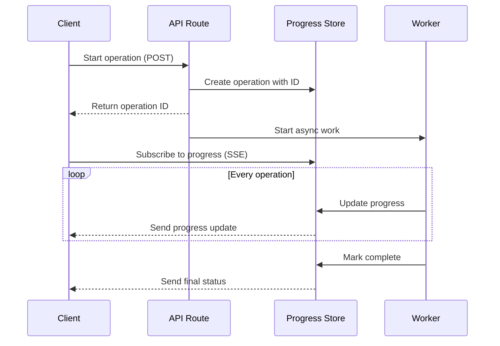

# Progress Bar Improvement Plan

## Problem Statement

1. **Missing Upload Progress Bar**: On the fetch page (`app/admin/fetch/page.tsx`), when uploading fetched data to the database, there is no progress bar displayed to the user.

2. **Simulated Progress**: Both fetch and upload operations use simulated progress bars that don't reflect actual progress. The progress is just a visual animation based on `setInterval` timers, not real-time updates from the server.

## Current State Analysis

### Fetch Page (`app/admin/fetch/page.tsx`)

**Fetch Operation (Lines 123-263):**
- Has progress state: `fetchProgress` (line 95)
- Shows progress bar using `ProgressBar` component
- Progress is SIMULATED using `setInterval` (lines 159-191)
- Updates every 200ms with fake progress increments

**Upload Operation (Lines 265-312):**
- Has `isUploading` state (line 100) but NO `uploadProgress` state
- Shows loading spinner in button but NO progress bar
- No visual feedback of upload progress

### Upload Page (`app/admin/upload/page.tsx`)

**Upload Operation (Lines 101-163):**
- Has progress state: `uploadProgress` (line 43)
- Shows progress bar (lines 358-391)
- Progress is SIMULATED using `setInterval` (lines 116-141)
- Updates every 100ms with fake progress increments

### Progress Bar Component (`components/ui/progress-bar.tsx`)

- Well-designed, reusable component
- Supports different statuses: initializing, validating, uploading, fetching, processing, retrying, completed, failed
- Shows percentage, current/total entries, and batch information

## Root Cause

The fundamental issue is that **server actions and API routes don't support real-time callbacks**. When a client calls a server action or API route, it waits for the entire operation to complete before receiving a response. There's no built-in mechanism to send progress updates during the operation.

## Solution Design

### Approach 1: Server-Sent Events (SSE) - Recommended

Server-Sent Events provide a simple way to push real-time updates from server to client over HTTP.

**Architecture:**



**Components to Create:**

1. **Progress Store** (`lib/progress/progress-store.ts`)
   - In-memory store for tracking operation progress
   - Methods: `create()`, `get()`, `update()`, `complete()`, `fail()`
   - Auto-cleanup of old operations

2. **Progress SSE Endpoint** (`app/api/progress/[id]/route.ts`)
   - SSE endpoint that streams progress updates to clients
   - Uses `ReadableStream` to send events

3. **Refactored Fetch API** (`app/api/prayer-times/fetch/route.ts`)
   - Create operation ID on start
   - Update progress during fetch operations
   - Mark complete when done

4. **Refactored Batch Upload API** (`app/api/schedule/batch/route.ts`)
   - Create operation ID on start
   - Update progress during batch operations
   - Mark complete when done

5. **Client-side Hook** (`hooks/use-progress.ts`)
   - Manages SSE connection
   - Provides progress state to components
   - Handles connection errors and retries

### Approach 2: Polling (Alternative)

If SSE is not feasible, use polling:

1. Create a progress status endpoint: `GET /api/progress/[id]`
2. Client polls this endpoint every 500-1000ms
3. Server returns current progress state

**Pros:** Simpler to implement, works everywhere
**Cons:** Higher server load, less real-time, more client-side complexity

### Approach 3: Keep Simulation (Quick Fix)

If real-time progress is too complex:

1. Add upload progress state to fetch page
2. Keep simulated progress but make it more realistic
3. Show progress bar during upload

**Pros:** Quick to implement
**Cons:** Still not real progress, misleading to users

## Implementation Plan

### Phase 1: Quick Fix (Add Upload Progress Bar to Fetch Page)

**Goal:** Add progress bar for upload operation on fetch page using simulated progress.

**Tasks:**
1. Add `uploadProgress` state to fetch page
2. Initialize progress when upload starts
3. Simulate progress updates during upload
4. Show `ProgressBar` component when uploading
5. Handle success/error states

**Files to Modify:**
- `app/admin/fetch/page.tsx`

### Phase 2: Real-Time Progress with SSE

**Goal:** Implement Server-Sent Events for real progress tracking.

**Tasks:**

1. **Create Progress Store**
   - Create `lib/progress/progress-store.ts`
   - Implement in-memory progress tracking
   - Add cleanup mechanism

2. **Create SSE Endpoint**
   - Create `app/api/progress/[id]/route.ts`
   - Implement SSE streaming
   - Handle connection lifecycle

3. **Create Progress Hook**
   - Create `hooks/use-progress.ts`
   - Manage SSE connection
   - Provide progress state

4. **Refactor Fetch API**
   - Modify `app/api/prayer-times/fetch/route.ts`
   - Integrate with progress store
   - Update progress during fetch

5. **Refactor Batch Upload API**
   - Modify `app/api/schedule/batch/route.ts`
   - Integrate with progress store
   - Update progress during upload

6. **Update Fetch Page**
   - Replace simulated progress with real progress
   - Use `use-progress` hook
   - Show real-time updates

7. **Update Upload Page**
   - Replace simulated progress with real progress
   - Use `use-progress` hook
   - Show real-time updates

**Files to Create:**
- `lib/progress/progress-store.ts`
- `app/api/progress/[id]/route.ts`
- `hooks/use-progress.ts`

**Files to Modify:**
- `app/admin/fetch/page.tsx`
- `app/admin/upload/page.tsx`
- `app/api/prayer-times/fetch/route.ts`
- `app/api/schedule/batch/route.ts`

## Data Structures

### Progress Operation

```typescript
interface ProgressOperation {
  id: string;
  type: 'fetch' | 'upload';
  status: 'initializing' | 'processing' | 'completed' | 'failed';
  current: number;
  total: number;
  percentage: number;
  batch: number;
  totalBatches: number;
  message?: string;
  error?: string;
  createdAt: Date;
  updatedAt: Date;
}
```

### SSE Event Format

```typescript
interface ProgressEvent {
  type: 'progress' | 'complete' | 'error';
  data: ProgressOperation;
}
```

## Implementation Details

### Progress Store

```typescript
class ProgressStore {
  private operations: Map<string, ProgressOperation> = new Map();
  
  create(type: 'fetch' | 'upload', total: number): string;
  get(id: string): ProgressOperation | undefined;
  update(id: string, updates: Partial<ProgressOperation>): void;
  complete(id: string): void;
  fail(id: string, error: string): void;
  cleanup(): void; // Remove old operations
}
```

### SSE Endpoint

```typescript
export async function GET(
  request: NextRequest,
  { params }: { params: { id: string } }
) {
  const encoder = new TextEncoder();
  
  const stream = new ReadableStream({
    start(controller) {
      // Send initial state
      // Subscribe to updates
      // Send updates as they arrive
    },
    cancel() {
      // Cleanup
    }
  });
  
  return new Response(stream, {
    headers: {
      'Content-Type': 'text/event-stream',
      'Cache-Control': 'no-cache',
      'Connection': 'keep-alive',
    },
  });
}
```

### Progress Hook

```typescript
function useProgress(operationId: string | null) {
  const [progress, setProgress] = useState<ProgressOperation | null>(null);
  const [error, setError] = useState<string | null>(null);
  
  useEffect(() => {
    if (!operationId) return;
    
    // Connect to SSE endpoint
    const eventSource = new EventSource(`/api/progress/${operationId}`);
    
    eventSource.onmessage = (event) => {
      const data = JSON.parse(event.data);
      setProgress(data);
      
      if (data.status === 'completed' || data.status === 'failed') {
        eventSource.close();
      }
    };
    
    eventSource.onerror = () => {
      setError('Connection error');
      eventSource.close();
    };
    
    return () => eventSource.close();
  }, [operationId]);
  
  return { progress, error };
}
```

## Testing Plan

1. **Unit Tests**
   - Progress store operations
   - Progress hook connection handling
   - Progress component rendering

2. **Integration Tests**
   - Fetch operation with progress
   - Upload operation with progress
   - Multiple concurrent operations

3. **Manual Testing**
   - Test fetch with single district
   - Test fetch with multiple districts
   - Test upload with small file
   - Test upload with large file
   - Test error handling
   - Test connection loss and recovery

## Migration Strategy

1. **Phase 1 (Quick Fix):** Deploy upload progress bar on fetch page (simulated)
2. **Phase 2 (Real Progress):** Implement SSE-based real progress
3. **Phase 3 (Cleanup):** Remove simulated progress code

## Rollback Plan

If SSE implementation has issues:
1. Keep simulated progress as fallback
2. Add feature flag to toggle between real and simulated progress
3. Monitor error rates and user feedback

## Success Criteria

1. ✅ Upload progress bar is shown on fetch page
2. ✅ Progress bars show real-time progress (not simulated)
3. ✅ Progress updates are accurate and reflect actual operation state
4. ✅ Error states are properly handled
5. ✅ Multiple concurrent operations work correctly
6. ✅ Performance impact is minimal

## Estimated Complexity

- **Phase 1 (Quick Fix):** Low complexity (~1-2 hours)
- **Phase 2 (SSE Implementation):** Medium-High complexity (~8-12 hours)
- **Phase 3 (Testing & Polish):** Medium complexity (~4-6 hours)

## Notes

- The progress store is in-memory and will reset on server restart
- For production, consider using Redis for distributed progress tracking
- SSE connections should have a timeout to prevent hanging connections
- Consider rate limiting progress updates to avoid overwhelming clients
