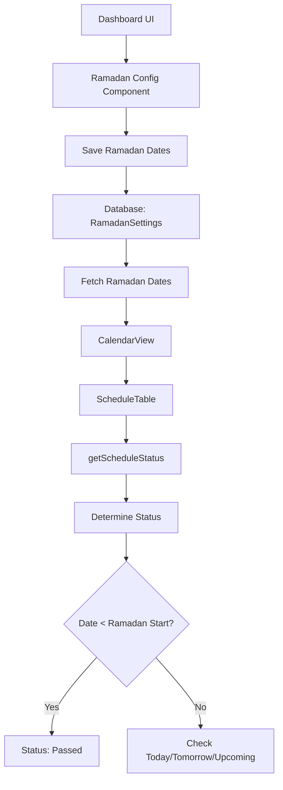

# Ramadan Date Configuration Implementation Plan

## Problem Statement

The system currently marks all dates before today as "passed" on the Schedule Table, regardless of whether they are before Ramadan or not. This is because the system doesn't have a reference to Ramadan start and end dates. The user wants to:

1. Take Ramadan start and end dates as input from the UI on the dashboard
2. Use these dates to determine the "passed" status on the Schedule Table
3. Only dates before Ramadan should be marked as "passed", not all dates before today

## Current Implementation Analysis

### Key Files Identified

1. **`lib/utils/schedule.utils.ts`** - Contains the `getScheduleStatus()` function that determines the status
   - Line 70-74: Currently marks any date before today as "passed"
   - This is the root cause of the issue

2. **`components/shared/schedule-table.tsx`** - Displays the schedule table with status badges
   - Uses `getScheduleStatus()` to determine the status of each entry
   - Needs to accept Ramadan dates as props

3. **`components/admin/calendar-view.tsx`** - Admin calendar view that uses ScheduleTable
   - Needs to fetch Ramadan dates and pass them to ScheduleTable

4. **`app/admin/dashboard/page.tsx`** - Admin dashboard page
   - Needs to add UI component for Ramadan date configuration

5. **`lib/config/app.config.ts`** - Contains `RAMADAN_CONFIG` with environment variables
   - Currently reads from `process.env.RAMADAN_START_DATE` and `process.env.RAMADAN_END_DATE`
   - These are optional and not validated

6. **`prisma/schema.prisma`** - Database schema
   - Has `TimeEntry`, `AdminUser`, and `UploadLog` models
   - Needs a new model for storing Ramadan settings

## Solution Architecture

### High-Level Flow



### Data Flow

1. **Admin sets Ramadan dates** → UI component captures start and end dates
2. **Save to database** → Server action stores dates in `RamadanSettings` table
3. **Fetch dates** → Components fetch Ramadan dates when rendering
4. **Pass to status function** → Ramadan dates passed to `getScheduleStatus()`
5. **Determine status** → Function uses Ramadan dates to determine if a date is "passed"

## Implementation Steps

### Step 1: Create Database Model

**File**: `prisma/schema.prisma`

Add a new model to store Ramadan settings:

```prisma
model RamadanSettings {
  id        String   @id @default(uuid())
  startDate String   // YYYY-MM-DD format
  endDate   String   // YYYY-MM-DD format
  updatedAt DateTime @updatedAt
  createdAt DateTime @default(now())

  @@index([startDate])
  @@index([endDate])
}
```

**Migration required**: Run `npx prisma migrate dev --name add_ramadan_settings`

### Step 2: Create Server Actions

**File**: `actions/ramadan-settings.actions.ts` (new file)

Create server actions for managing Ramadan settings:

```typescript
'use server'

import { prisma } from '@/lib/db'
import { revalidatePath } from 'next/cache'

// Get Ramadan settings
export async function getRamadanSettings() {
  try {
    let settings = await prisma.ramadanSettings.findFirst()
    
    // If no settings exist, create default settings
    if (!settings) {
      settings = await prisma.ramadanSettings.create({
        data: {
          startDate: '', // Will be set by admin
          endDate: '',   // Will be set by admin
        }
      })
    }
    
    return {
      success: true,
      startDate: settings.startDate,
      endDate: settings.endDate,
    }
  } catch (error) {
    console.error('Error fetching Ramadan settings:', error)
    return {
      success: false,
      error: 'Failed to fetch Ramadan settings',
      startDate: '',
      endDate: '',
    }
  }
}

// Update Ramadan settings
export async function updateRamadanSettings(startDate: string, endDate: string) {
  try {
    // Validate dates
    if (!startDate || !endDate) {
      return {
        success: false,
        error: 'Start date and end date are required',
      }
    }
    
    // Validate date format (YYYY-MM-DD)
    const dateRegex = /^\d{4}-\d{2}-\d{2}$/
    if (!dateRegex.test(startDate) || !dateRegex.test(endDate)) {
      return {
        success: false,
        error: 'Invalid date format. Use YYYY-MM-DD format',
      }
    }
    
    // Validate that end date is after start date
    if (new Date(endDate) < new Date(startDate)) {
      return {
        success: false,
        error: 'End date must be after start date',
      }
    }
    
    // Get or create settings
    let settings = await prisma.ramadanSettings.findFirst()
    
    if (settings) {
      // Update existing settings
      settings = await prisma.ramadanSettings.update({
        where: { id: settings.id },
        data: { startDate, endDate },
      })
    } else {
      // Create new settings
      settings = await prisma.ramadanSettings.create({
        data: { startDate, endDate },
      })
    }
    
    // Revalidate cache
    revalidatePath('/admin/dashboard')
    
    return {
      success: true,
      startDate: settings.startDate,
      endDate: settings.endDate,
    }
  } catch (error) {
    console.error('Error updating Ramadan settings:', error)
    return {
      success: false,
      error: 'Failed to update Ramadan settings',
    }
  }
}
```

### Step 3: Modify getScheduleStatus Function

**File**: `lib/utils/schedule.utils.ts`

Update the function to accept Ramadan dates and use them to determine the "passed" status:

```typescript
export interface RamadanDates {
  startDate?: string; // YYYY-MM-DD format
  endDate?: string;   // YYYY-MM-DD format
}

export function getScheduleStatus(
  entry: TimeEntry, 
  allEntries: TimeEntry[] = [],
  ramadanDates?: RamadanDates
): ScheduleStatusResult {
  const userTimezone = getUserTimezone();
  const today = moment().tz(userTimezone);
  const entryDate = moment.tz(entry.date, userTimezone);
  
  const sehriTime = parseTime(entry.sehri);
  const iftarTime = parseTime(entry.iftar);
  
  let status: ScheduleStatus;
  let statusText: string;
  let rowClass: string;
  
  // Check if Ramadan dates are configured
  const ramadanStartDate = ramadanDates?.startDate 
    ? moment.tz(ramadanDates.startDate, userTimezone) 
    : null;
  
  if (ramadanStartDate && entryDate.isBefore(ramadanStartDate, 'day')) {
    // Date is before Ramadan - mark as passed
    status = "passed";
    statusText = "Passed";
    rowClass = "bg-red-500/15 border-l-4 border-l-red-500/60 border-b border-red-500/40";
  } else if (entryDate.isBefore(today, 'day')) {
    // Past dates (but during or after Ramadan) - mark as passed
    status = "passed";
    statusText = "Passed";
    rowClass = "bg-red-500/15 border-l-4 border-l-red-500/60 border-b border-red-500/40";
  } else if (entryDate.isSame(today, 'day')) {
    // Today: check if both sehri and iftar times have passed
    const sehriPassed = isTimePast(sehriTime.hours, sehriTime.minutes);
    const iftarPassed = isTimePast(iftarTime.hours, iftarTime.minutes);
    if (sehriPassed && iftarPassed) {
      status = "passed";
      statusText = "Passed";
      rowClass = "bg-red-500/15 border-l-4 border-l-red-500/60 border-b border-red-500/40";
    } else {
      status = "today";
      statusText = "Today";
      rowClass = "bg-blue-500/6 border-blue-500/20";
    }
  } else {
    // Future dates: check if it's tomorrow
    const tomorrow = moment().tz(userTimezone).add(1, 'day');
    const isTomorrow = entryDate.isSame(tomorrow, 'day');
    
    if (isTomorrow) {
      status = "tomorrow";
      statusText = "Tomorrow";
      rowClass = "hover:bg-primary/4 border-border/40";
    } else {
      status = "upcoming";
      statusText = "Upcoming";
      rowClass = "hover:bg-primary/4 border-border/40";
    }
  }
  
  return { status, statusText, rowClass };
}
```

### Step 4: Update ScheduleTable Component

**File**: `components/shared/schedule-table.tsx`

Update the component to accept Ramadan dates as props:

```typescript
export interface ScheduleTableProps {
  entries: TimeEntry[];
  showLocation?: boolean;
  showStatus?: boolean;
  showTodayBadge?: boolean;
  rowClassVariant?: "full" | "simple";
  // Admin mode props
  editable?: boolean;
  selectedIds?: Set<string>;
  onSelectAll?: (checked: boolean) => void;
  onSelectOne?: (id: string, checked: boolean) => void;
  onEdit?: (entry: TimeEntry) => void;
  onDelete?: (entry: TimeEntry) => void;
  isAllSelected?: boolean;
  // Ramadan dates for status determination
  ramadanDates?: {
    startDate?: string;
    endDate?: string;
  };
}

export function ScheduleTable({
  entries,
  showLocation = true,
  showStatus = true,
  showTodayBadge = true,
  rowClassVariant = "full",
  editable = false,
  selectedIds,
  onSelectAll,
  onSelectOne,
  onEdit,
  onDelete,
  isAllSelected = false,
  ramadanDates,
}: ScheduleTableProps) {
  // ... existing code ...
  
  const { status, rowClass } = getScheduleStatus(entry, entries, ramadanDates);
  
  // ... rest of the code ...
}
```

### Step 5: Create Ramadan Configuration UI Component

**File**: `components/admin/ramadan-config.tsx` (new file)

Create a component for configuring Ramadan dates:

```typescript
"use client";

import React, { useState, useEffect } from "react";
import { Card, CardContent, CardDescription, CardHeader, CardTitle } from "@/components/ui/card";
import { Button } from "@/components/ui/button";
import { Input } from "@/components/ui/input";
import { Label } from "@/components/ui/label";
import { Calendar, Save, RefreshCw } from "lucide-react";
import { updateRamadanSettings, getRamadanSettings } from "@/actions/ramadan-settings.actions";
import { toast } from "sonner";

export function RamadanConfig() {
  const [startDate, setStartDate] = useState("");
  const [endDate, setEndDate] = useState("");
  const [isLoading, setIsLoading] = useState(false);
  const [isSaving, setIsSaving] = useState(false);

  // Load settings on mount
  useEffect(() => {
    loadSettings();
  }, []);

  const loadSettings = async () => {
    setIsLoading(true);
    const result = await getRamadanSettings();
    if (result.success) {
      setStartDate(result.startDate || "");
      setEndDate(result.endDate || "");
    }
    setIsLoading(false);
  };

  const handleSave = async () => {
    setIsSaving(true);
    const result = await updateRamadanSettings(startDate, endDate);
    setIsSaving(false);
    
    if (result.success) {
      toast.success("Ramadan dates updated successfully");
    } else {
      toast.error(result.error || "Failed to update Ramadan dates");
    }
  };

  return (
    <Card className="border-primary/30 overflow-hidden shadow-sm bg-primary/5 backdrop-blur-sm">
      <CardHeader className="flex flex-row items-center justify-between space-y-0 pb-2 pt-4">
        <div>
          <CardTitle className="text-sm font-bold uppercase tracking-wide text-muted-foreground">
            Ramadan Configuration
          </CardTitle>
          <CardDescription className="text-xs mt-1">
            Set Ramadan start and end dates for status determination
          </CardDescription>
        </div>
        <div className="p-2 rounded-lg bg-primary/10">
          <Calendar className="h-4 w-4 text-primary" />
        </div>
      </CardHeader>
      <CardContent className="pt-4">
        <div className="grid gap-4">
          <div className="grid gap-1.5">
            <Label htmlFor="ramadan-start" className="text-sm font-semibold">
              Ramadan Start Date
            </Label>
            <Input
              id="ramadan-start"
              type="date"
              value={startDate}
              onChange={(e) => setStartDate(e.target.value)}
              disabled={isLoading || isSaving}
              className="h-10 rounded-xl border-border/60"
            />
          </div>
          <div className="grid gap-1.5">
            <Label htmlFor="ramadan-end" className="text-sm font-semibold">
              Ramadan End Date
            </Label>
            <Input
              id="ramadan-end"
              type="date"
              value={endDate}
              onChange={(e) => setEndDate(e.target.value)}
              disabled={isLoading || isSaving}
              className="h-10 rounded-xl border-border/60"
            />
          </div>
          <div className="flex gap-2">
            <Button
              onClick={handleSave}
              disabled={isSaving || isLoading}
              className="btn-gradient rounded-full gap-2 font-semibold flex-1"
            >
              {isSaving ? (
                <RefreshCw className="h-4 w-4 animate-spin" />
              ) : (
                <Save className="h-4 w-4" />
              )}
              {isSaving ? "Saving..." : "Save Dates"}
            </Button>
          </div>
        </div>
      </CardContent>
    </Card>
  );
}
```

### Step 6: Update CalendarView Component

**File**: `components/admin/calendar-view.tsx`

Update the component to fetch Ramadan dates and pass them to ScheduleTable:

```typescript
import { getRamadanSettings } from "@/actions/ramadan-settings.actions";

interface CalendarViewProps {
  entries: Array<TimeEntry & { sehri24?: string; iftar24?: string }>;
  locations: string[];
  ramadanDates?: {
    startDate?: string;
    endDate?: string;
  };
}

export function CalendarView({ entries, locations, ramadanDates }: CalendarViewProps) {
  // ... existing code ...

  return (
    <>
      {/* ... existing code ... */}
      
      <ScheduleTable
        entries={entries}
        showLocation={true}
        showStatus={true}
        showTodayBadge={true}
        rowClassVariant="full"
        editable={true}
        selectedIds={selectedIds}
        onSelectAll={handleSelectAll}
        onSelectOne={handleSelectOne}
        onEdit={handleEdit}
        onDelete={setDeletingEntry}
        isAllSelected={isAllSelected}
        ramadanDates={ramadanDates}
      />
      
      {/* ... existing code ... */}
    </>
  );
}
```

### Step 7: Update Dashboard Page

**File**: `app/admin/dashboard/page.tsx`

Update the dashboard to fetch Ramadan dates and integrate the configuration UI:

```typescript
import { getRamadanSettings } from "@/actions/ramadan-settings.actions";
import { RamadanConfig } from "@/components/admin/ramadan-config";

export default async function AdminDashboard() {
  const session = await withDashboardGuard();

  const stats = await getStats();
  const schedule = await getFullSchedule(null);
  const locations = await getLocations();
  const ramadanSettings = await getRamadanSettings();

  const ramadanDates = ramadanSettings.success ? {
    startDate: ramadanSettings.startDate,
    endDate: ramadanSettings.endDate,
  } : undefined;

  // ... existing statCards code ...

  return (
    <div className="w-full max-w-5xl mx-auto py-6 sm:py-10 px-4 space-y-6 sm:space-y-8">
      {/* ── Hero ─────────────────────────────── */}
      <PageHero
        subtitle="Admin Panel"
        title={<span className="gradient-text">Dashboard</span>}
        description="Manage Sehri & Iftar schedules"
        icon={LayoutDashboard}
        actions={
          <>
            <CacheClearButton />

            <Link href="/admin/import" className="w-full sm:w-auto">
              <Button className="btn-gradient rounded-full gap-2 font-semibold w-full sm:w-auto px-6">
                <Upload className="h-4 w-4" />
                Upload Schedule
              </Button>
            </Link>

            <Link href="/admin/fetch" className="w-full sm:w-auto">
              <Button className="btn-gradient rounded-full gap-2 font-semibold w-full sm:w-auto px-6">
                <Upload className="h-4 w-4" />
                Fetch Schedule
              </Button>
            </Link>
          </>
        }
      />

      {/* ── Stat Cards & Ramadan Config ────────── */}
      <div className="grid gap-4 grid-cols-1 md:grid-cols-3 lg:grid-cols-4">
        {statCards.map(({ title, value, description, icon: Icon, gradient, iconColor, iconBg }) => (
          <Card key={title} className="border-primary/30 overflow-hidden shadow-sm bg-primary/5 backdrop-blur-sm">
            {/* ... existing card code ... */}
          </Card>
        ))}
        
        {/* Ramadan Configuration Card */}
        <RamadanConfig />
      </div>

      {/* ── Calendar Card ───────────────────── */}
      <ScheduleCard
        title="Schedule Calendar"
        description={`Manage all Sehri & Iftar entries (${schedule.length} total)`}
      >
        {schedule.length > 0 ? (
          <CalendarView entries={schedule} locations={locations} ramadanDates={ramadanDates} />
        ) : (
          <NoScheduleCard />
        )}
      </ScheduleCard>
    </div>
  );
}
```

## Testing Checklist

- [ ] Verify database migration runs successfully
- [ ] Test saving Ramadan dates from the dashboard UI
- [ ] Verify that dates before Ramadan are marked as "passed"
- [ ] Verify that dates during Ramadan show correct status (today/tomorrow/upcoming)
- [ ] Verify that dates after Ramadan show correct status
- [ ] Test validation (end date must be after start date)
- [ ] Test date format validation (YYYY-MM-DD)
- [ ] Test that the configuration persists across page refreshes
- [ ] Test with empty Ramadan dates (should fall back to current behavior)
- [ ] Test on mobile and desktop responsive layouts

## Edge Cases to Consider

1. **Empty Ramadan dates**: If no dates are set, the system should fall back to the current behavior (mark dates before today as passed)

2. **Invalid date format**: The UI should validate and show error messages for invalid formats

3. **End date before start date**: The system should validate and prevent this

4. **Timezone handling**: Ensure all date comparisons use the same timezone

5. **Multiple admins**: If multiple admins access the dashboard, they should see the same Ramadan settings

6. **Database connection failure**: Handle gracefully if the database is unavailable

## Future Enhancements

1. Add support for multiple Ramadan periods (e.g., for different years)

2. Add a history of Ramadan date changes

3. Add automatic detection of Ramadan dates based on Hijri calendar

4. Add notifications when Ramadan is approaching

5. Add export/import of Ramadan settings

## Summary

This implementation will:
- Add a database model to store Ramadan settings
- Create server actions to manage Ramadan dates
- Add a UI component on the dashboard for configuring Ramadan dates
- Modify the status determination logic to use Ramadan dates
- Ensure backward compatibility when Ramadan dates are not set

The solution is modular, maintainable, and follows the existing codebase patterns.
